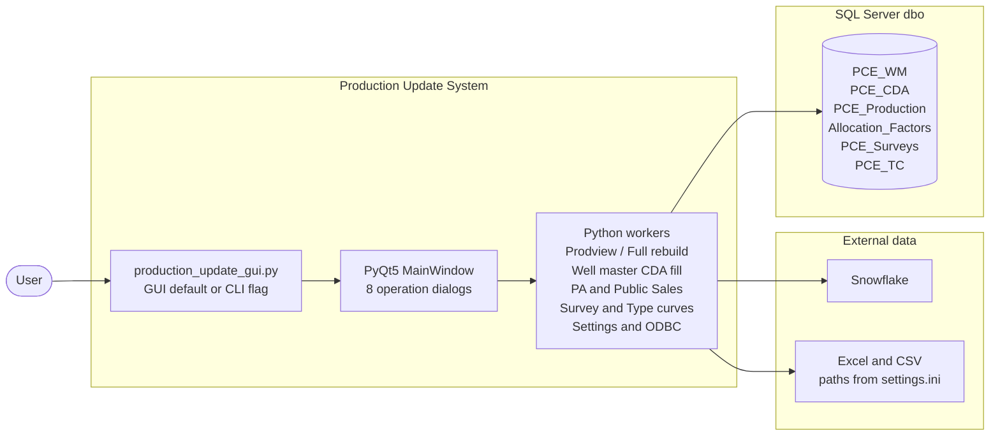

# Production Update System — Application architecture (single overview)

One **Mermaid** diagram below is meant to export as **a single image** (for example PNG from [mermaid.live](https://mermaid.live)). Detail, script order, and destructive steps are in [`USER_GUIDE.md`](USER_GUIDE.md) (Runbook and module sections).

---

## Architecture overview

**How to read it**

- **Desktop** — Entry point opens the **UI**; dialogs call **Core** Python modules (same codebase as optional terminal scripts such as `python production_update.py` or `python survey_import.py …`).  
- **External** — **Snowflake** supplies daily production for Prodview and well loads; **files** supply ValNav, Accumap, survey, type curve, and Whitson workbooks.  
- **SQL Server** — All persistent well, daily, production, allocation, survey, and type-curve tables the app writes during normal operations.

**Not drawn (to keep the image small)**

- Optional **`--accumap-unmatched`** branch on the same entry file (terminal audit, read-only on WM / Accumap).  
- **Whitson** (read/log stub) and **Exports** (placeholder UI) — no routine database writes; **Exports** is last in the main window list.

---

## Optional: export one PNG

1. Open [mermaid.live](https://mermaid.live).  
2. Paste the fenced `flowchart LR` block only (from `flowchart LR` through the closing line).  
3. **Actions → PNG** (or SVG) for your Word pack or slide deck.

---

*This file is documentation only; it does not change application behavior.*
