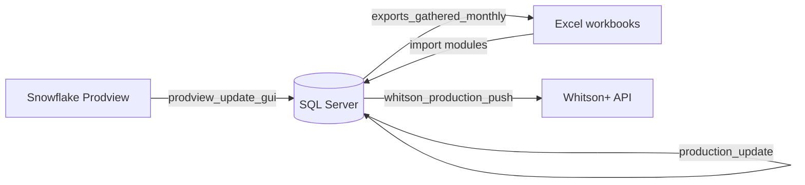
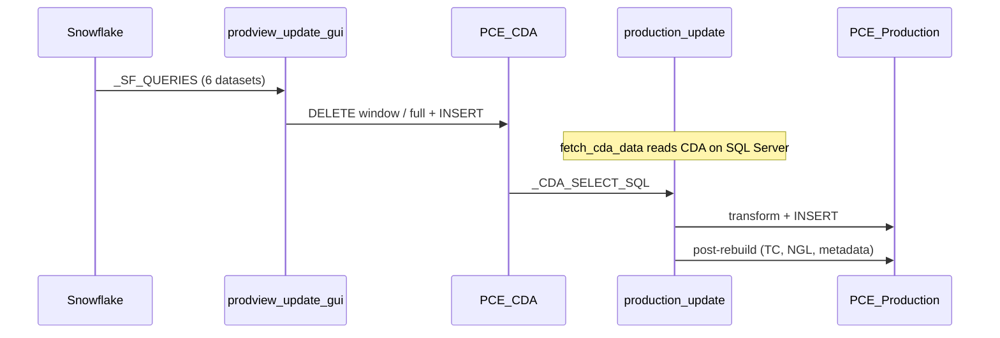

# Data Pull & Query Guide — Developer Reference

**Organization:** Pacific Canbriam Energy LTD  
**Document version:** 1.0  
**Last updated:** June 2026  
**Audience:** Developers maintaining the Production Update System  

**Related docs**

| Document | Purpose |
|----------|---------|
| [PRODUCTION_UPDATE_GUIDE.md](./PRODUCTION_UPDATE_GUIDE.md) | Operator runbook (screenshots, monthly checklist) |
| [HANDOFF_FILE_INVENTORY.md](./HANDOFF_FILE_INVENTORY.md) | Which files ship with the app |
| [DATABASE_INDEXES.md](./DATABASE_INDEXES.md) | Recommended SQL Server indexes |

---

## Table of contents

1. [Overview](#1-overview)
2. [Configuration & connections](#2-configuration--connections)
3. [Where queries live](#3-where-queries-live)
4. [SQL Server tables (hub)](#4-sql-server-tables-hub)
5. [Data paths by source](#5-data-paths-by-source)
6. [Prodview / Snowflake → CDA → Production](#6-prodview--snowflake--cda--production)
7. [Well Master](#7-well-master)
8. [Allocation factors (ValNav, Accumap, NGL)](#8-allocation-factors-valnav-accumap-ngl)
9. [Type curves, surveys, forecasts](#9-type-curves-surveys-forecasts)
10. [Exports and Whitson+ push](#10-exports-and-whitson-push)
11. [Post-rebuild pipeline](#11-post-rebuild-pipeline)
12. [GUI → module map](#12-gui--module-map)
13. [Scripts folder (non-runtime SQL)](#13-scripts-folder-non-runtime-sql)
14. [Common developer pitfalls](#14-common-developer-pitfalls)
15. [Suggested change workflow](#15-suggested-change-workflow)

---

## 1. Overview

The app is a **PyQt5 desktop client** (`production_update_gui.py`). It does not run a background service. Data movement falls into four buckets:

| Bucket | Direction | Examples |
|--------|-----------|----------|
| **External pull** | Source → SQL Server | Snowflake Prodview, Excel workbooks |
| **Internal transform** | SQL Server → SQL Server | `PCE_CDA` → `PCE_Production`, AF → CDA ratios |
| **External push** | SQL Server → API | Whitson+ production and attributes |
| **Export** | SQL Server → Excel | Gathered monthly report |



**Dependency order** (simplified):

1. Well Master (`PCE_WM`) — includes Snowflake well import for new meters  
2. Prodview refresh → `PCE_CDA` + `PCE_Production`  
3. ValNav monthly → `Allocation_Factors` → apply to CDA/Production  
4. Public Sales (Accumap) → sales gas on AF + CDA  
5. Optional: surveys, type curves, forecasts  
6. Exports / Whitson push  

---

## 2. Configuration & connections

### SQL Server

| Item | Location |
|------|----------|
| Module | `db_connection.py` |
| API | `get_sql_conn()`, `sql_connection()` context manager, `probe_sql_connection()` |
| Auth | Windows integrated (`Trusted_Connection=yes`) |
| Defaults | `.env`: `SQL_SERVER`, `SQL_DATABASE`, `SQL_DRIVER` |
| Override | `settings.ini [SQL]` **wins** over `.env` for `server` / `database` |
| Runtime save | `configure_sql_targets()` — Settings dialog; may sync back to `.env` |

```ini
[SQL]
server = CALVMSQL01
database = Re_Main_Production
```

### Snowflake (Prodview)

| Item | Location |
|------|----------|
| Module | `snowflake_connector.py` |
| Class | `SnowflakeConnector` — `connect()`, `query(sql, params)` → pandas |
| Config | `.env` only (next to app / exe) |

Required `.env` keys: `SNOWFLAKE_ACCOUNT`, `SNOWFLAKE_USER`, `SNOWFLAKE_PASSWORD`.  
Optional: `SNOWFLAKE_WAREHOUSE`, `SNOWFLAKE_DATABASE`, `SNOWFLAKE_SCHEMA`, `SNOWFLAKE_ROLE`.

### Whitson+ (push only — not a data source)

| Item | Location |
|------|----------|
| Credentials | `whitson_credentials.py` — `settings.ini [WHITSON]` then `WHITSON_*` env vars |
| REST client | `whitson_connect.py` |
| Units | `whitson_imperial.ini` via `whitson_imperial_units.py` |
| SSL | Optional `[WHITSON] ca_bundle` → `ssl_trust.py` |

```ini
[WHITSON]
client = pacificcanbriam
client_id = ...
client_secret = ...
project_id = 2
project_label = Montney base case   ; optional friendly name in UI
```

### Excel file paths

`settings.ini [PATHS]` — resolved by `app_paths.get_settings_path()` and Settings dialog:

| Key | Used by |
|-----|---------|
| `valnav_template` | ValNav monthly loader |
| `accumap_template` | Public sales / Accumap |
| `survey_file` | Legacy flat survey import |
| `type_curves_file` | Type curves append |
| `monthly_forecasts_template` | Forecast import |
| `whitson_file` | Configured but **mass upload reads live SQL**, not this file |

### Application password

`app_password.py` — startup gate only; unrelated to database credentials.

---

## 3. Where queries live

### Runtime queries → inline in Python

**All ETL queries used at runtime are embedded as strings in `.py` files.** The running app does not load `.sql` files from disk.

| Domain | Primary file(s) | Query constants / patterns |
|--------|-----------------|----------------------------|
| Snowflake Prodview pulls | `prodview_update_gui.py` | `_SF_QUERIES`, `_SF_FIRST_PROD_*_SQL` |
| CDA read for production rebuild | `production_update.py` | `_CDA_SELECT_SQL`, `fetch_cda_data()` |
| Production insert | `production_update.py`, `pce_production_schema.py` | `build_production_insert_sql()`, shared column list |
| AF → CDA / Production ratios | `sales_allocation_updates.py` | `apply_valnav_allocation_bulk()`, `apply_full_sales_ratios_bulk()` |
| NGL daily `_R` columns | `ngl_monthly_update.py` | Staging INSERT + `UPDATE … JOIN` on `PCE_Production` |
| Well Master CRUD | `well_master_db.py` | SELECT/UPDATE/DELETE on `PCE_WM` |
| Type curves | `type_curves_import.py`, `sync_typecurves_to_production.py` | INSERT/SELECT `PCE_TC` |
| Surveys | `survey_import.py` | `INSERT_SQL` → `PCE_Surveys` |
| Forecasts | `monthly_forecasts_import.py`, `pce_frcst_prd_rebuild.py` | Forecast table INSERT/rebuild |
| Whitson push reads | `whitson_production_push.py`, `whitson_well_attributes.py` | `_FETCH_PROD_SQL`, WM metadata SELECT |
| Exports | `exports_gathered_monthly.py` | Month-spine aggregation from `PCE_Production` |
| Snowflake well import | `well_master_gui.py` | Inline SELECT in `WellMasterSnowflakeImportWorker` |

### `scripts/*.sql` → schema / DBA only

Run manually in SSMS. **Not loaded by the app.**

Examples:

- `scripts/create_pce_frcst_prd.sql`, `scripts/create_pce_ngl_staging.sql` — table DDL  
- `scripts/add_pce_*.sql` — column migrations  
- `scripts/recommended_indexes.sql` — performance  
- `scripts/verify_wm_uwi_sync.sql`, `scripts/query_wm_without_surveys_by_uwi.sql` — audits  

When adding a column the app expects, add a migration script **and** update the Python INSERT/SELECT lists (especially `pce_production_schema.py` for production columns).

### Support / CLI scripts

| Script | Role |
|--------|------|
| `scripts/diagnose_gathered_water_snowflake.py` | Compare Snowflake vs SQL gathered water |
| `scripts/diagnose_gathered_monthly_export.py` | Debug export aggregation |
| `scripts/whitson_upload.py` | Single-well Whitson CLI push |
| `scripts/backfill_wm_*.py` | Excel → `PCE_WM` one-offs |

---

## 4. SQL Server tables (hub)

| Table | Role | Key join |
|-------|------|----------|
| **`PCE_WM`** | Well master: IDRECs, composite name, UWI, pad, coordinates | `GasIDREC`, `PressuresIDREC`, `[Well Name]` |
| **`PCE_CDA`** | Daily CDA landing from Snowflake (before production transform) | `[Well Name]` → WM |
| **`PCE_Production`** | Materialized daily production (sequences, cumulatives, sales, NGL `_R`) | `[Well Name]` → WM |
| **`Allocation_Factors`** | Monthly PA volumes, sales gas, NGL, alloc ratios | `[Well Name]` + `MonthStartDate` |
| **`PCE_TC`** | Type curve rates (Excel import) | `[Well Name]` |
| **`PCE_Surveys`** | Directional / flat survey stations | UWI / well match |
| **`PCE_Monthly_Forecasts`** | Imported forecast workbook rows | `[Month]` label |
| **`PCE_FRCST_PRD`** | Reporting blend: forecasts + gathered production | Rebuilt after imports |
| **`PCE_NGL_Daily_Staging`** | Temp table for bulk NGL ratio UPDATE | Staging only |

`PCE_WM.[Well Name]` is the FK hub for deletes and metadata sync. See `well_master_db.py` delete logic and `purge_exception_wells.py`.

---

## 5. Data paths by source

| Source | Read module | Write table(s) | Config |
|--------|-------------|----------------|--------|
| Snowflake Prodview | `prodview_update_gui.py` | `PCE_CDA` | `.env` |
| Snowflake units (well import) | `well_master_gui.py` | `PCE_WM` | `.env` |
| ValNav Excel | `monthly_loader_gui.py` | `Allocation_Factors`, then CDA/Production | `[PATHS] valnav_template` |
| Accumap Excel | `sales_allocation_updates.py` | `Allocation_Factors`, then CDA | `[PATHS] accumap_template` |
| NGL summary Excel | `ngl_allocation_load.py` | `Allocation_Factors` | User-selected file |
| Type curves Excel | `type_curves_import.py` | `PCE_TC` → `PCE_Production` | `[PATHS] type_curves_file` |
| Survey Excel/CSV | `survey_import.py` | `PCE_Surveys` | `[PATHS] survey_file` or file picker |
| Forecasts Excel | `monthly_forecasts_import.py` | `PCE_Monthly_Forecasts` | `[PATHS] monthly_forecasts_template` |
| SQL internal | `production_update.py` | `PCE_Production` | — |
| SQL → Whitson | `whitson_production_push.py` | Whitson API (no SQL write) | `[WHITSON]` |

---

## 6. Prodview / Snowflake → CDA → Production

This is the largest path. **Two modules, two stages:**

### Stage A — Snowflake → `PCE_CDA`

| Item | Detail |
|------|--------|
| Entry | `prodview_update_dialog.py` → `prodview_update_gui.py` |
| Modes | **Routine** (`run_quick_update`) — rolling ~12 months; **Full rebuild** (`refresh_full_rebuild_cda` + `production_update.main`) |
| Date bounds | `prodview_date_bounds.py` — `rolling_window_snowflake_range()`, `full_rebuild_snowflake_range()`, `prodview_effective_end_date()` |
| Snowflake queries | `_SF_QUERIES` dict in `prodview_update_gui.py` (lines ~42–119) |

**Snowflake objects queried** (database `PACIFICCANBRIAM_PV30`, schema `UNITSMETRIC`):

| Key | ID column | Source table | Columns pulled |
|-----|-----------|--------------|----------------|
| `ecf` | `GASIDREC` | `pvUnitMeterOrificeEcf` | ECF ratio |
| `gaswh` | `GASIDREC` | `pvUnitMeterOrificeEntry` | Gas WH, on-prod hours |
| `cgr_water` | `PRESSURESIDREC` | `pvUnitCompGathMonthDayCalc` | CGR, allocated water |
| `wgr` | `PRESSURESIDREC` | `pvUnitCompRatios` | WGR |
| `pressures` | `PRESSURESIDREC` | `pvUnitCompParam` | Tubing/casing pressure, choke |
| `alloc` | `PRESSURESIDREC` | `pvunitallocmonthday` | Gathered gas/cond/water, NGL alloc |

Pull orchestration:

- `_pull_all_snowflake_data(sf, start, end, log)` — runs all six queries with `(start, end)` params  
- `_fetch_well_mapping(cursor)` — reads `PCE_WM` for `GasIDREC` / `PressuresIDREC` spine  
- `_build_spine()` — cross-join wells × dates, merge Snowflake frames on IDREC + date  
- `refresh_rolling_window_cda()` / `refresh_full_rebuild_cda()` — DELETE old rows, INSERT into `PCE_CDA`  

First production dates (full rebuild only):

- `_SF_FIRST_PROD_GASWH_SQL` — min date where `VOLENTERGAS > 2`  
- `_SF_FIRST_PROD_GATHERED_SQL` — min date where gathered gas > 0  

### Stage B — `PCE_CDA` → `PCE_Production`

| Item | Detail |
|------|--------|
| Module | `production_update.py` |
| **Important** | `fetch_cda_data()` reads **`PCE_CDA` on SQL Server**, not Snowflake |

Key functions:

| Function | Purpose |
|----------|---------|
| `fetch_cda_data(well_names, end_cap, conn, …)` | SELECT from `PCE_CDA` with optional date/well filters (`_CDA_SELECT_SQL`) |
| `filter_to_first_production()` | Trim rows before first meaningful production |
| `apply_well_names()` / WM lookups | Map CDA names → production composite names |
| `calculate_sequences()` / cumulatives | Day/month/year sequences and running totals |
| `_refresh_cda_sales_from_allocation_factors()` | Repaint Gas S2, sales, CGR on `PCE_CDA` from AF (batched) |
| `_refresh_ngl_from_allocation_factors()` | Spread monthly NGL from AF → daily `_R` on `PCE_Production` |
| `insert_pce_production()` | Bulk INSERT into `PCE_Production` |
| `main()` | Full rebuild CLI/GUI path |

Routine update (`run_quick_update` in `prodview_update_gui.py`):

1. Trim future CDA/Production rows  
2. DELETE rolling window in `PCE_Production`  
3. Snowflake refresh → `PCE_CDA`  
4. AF sales refresh (window-scoped)  
5. Load full CDA history for wells in window → rebuild window rows in `PCE_Production`  
6. `run_post_production_rebuild_steps()` — see §11  
7. `rebuild_all_production_sequences_from_scratch()` — full-table sequence pass for routine path  

Full rebuild (`production_update.main()`):

1. Snowflake first-prod per well  
2. Full CDA load (date cap in SQL)  
3. TRUNCATE / clear `PCE_Production`  
4. Insert all wells with inline sequence/cumulative calc  
5. Post-rebuild pipeline on shared connection  



---

## 7. Well Master

| Item | Detail |
|------|--------|
| DB layer | `well_master_db.py` — `WellMasterDB.load_wells()`, save/delete, additional fields |
| GUI | `well_master_gui.py` |
| Snowflake import | `WellMasterSnowflakeImportWorker` — inline query joining `pvunit` → `pvunitcomp` → `pvunitmeterorifice` → `pvunitmeterorificeentry` |

Snowflake import finds **Daily / Tester** meters not yet in `PCE_WM`, assigns `GasIDREC` / `PressuresIDREC`, and INSERTs new rows.

All other Well Master operations are **SQL Server only** (grid edit, additional fields dialog, exception flag).

---

## 8. Allocation factors (ValNav, Accumap, NGL)

### ValNav monthly (PA)

| Item | Detail |
|------|--------|
| GUI | `monthly_loader_dialog.py` → `monthly_loader_gui.py` |
| Excel | Month sheet by name pattern; column resolution in `valnav_columns.py` |
| Flow | Read ValNav → match UWI to `PCE_WM` → DELETE/INSERT `Allocation_Factors` for month → apply S2/condensate to CDA + Production → trigger NGL ratio refresh |

### Public sales (Accumap)

| Item | Detail |
|------|--------|
| GUI | `sales_ratios_dialog.py` → `sales_ratios_gui.py` |
| Core | `sales_allocation_updates.py` |
| Excel | Sheet `Sales Gas - to PRW` — `load_accumap_sales_workbook()`, `read_accumap_sales_by_uwi()` |
| SQL | `merge_accumap_into_allocation_factors()` then bulk `UPDATE` JOINs on `PCE_CDA` / `PCE_Production` |

Bulk apply functions (used by full rebuild and routine update):

- `apply_valnav_allocation_bulk(conn, date_window=…)`  
- `apply_full_sales_ratios_bulk(conn, date_window=…)`  

When `date_window` is set, only AF months overlapping the range are processed (routine update).

### NGL ratios

| Item | Detail |
|------|--------|
| Bulk Excel load | `ngl_allocation_load.py` → `Allocation_Factors` NGL columns |
| Daily spread | `ngl_monthly_update.py` — `run_ngl_bulk_from_allocation_factors()` |
| Staging table | `PCE_NGL_Daily_Staging` (see `scripts/create_pce_ngl_staging.sql`) |

NGL math uses a 3-month rolling gathered-gas average (`DEFAULT_GAS_ROLLING_MONTHS = 3`). Routine update passes `date_window` so only overlapping months are recomputed.

---

## 9. Type curves, surveys, forecasts

### Type curves

| Step | Module | Action |
|------|--------|--------|
| Excel → `PCE_TC` | `type_curves_import.py` | Sheet 1, unit conversion, INSERT |
| GUI | `type_curves_import_dialog.py` | Append or delete |
| TC → Production | `sync_typecurves_to_production.py` | `sync_tc_to_production()` — INSERT into `PCE_Production` at `ImportDate` |

TC wells use `[Well Name]` suffix ` - TC`; excluded from some WM pad sync and Whitson push filters.

### Surveys

| Module | Formats |
|--------|---------|
| `survey_import.py` | Legacy flat grid, Accumap grid, directional with column mapping |
| `survey_import_dialog.py` | GUI; presets in `survey_mapping_presets.json` |

WM match: composite name, UWI, trim candidates — see `lookup_wm_uwi_pad_for_directional()`.

### Monthly forecasts

| Step | Module |
|------|--------|
| Excel import | `monthly_forecasts_import.py` → `PCE_Monthly_Forecasts` |
| Reporting rebuild | `pce_frcst_prd_rebuild.py` → `PCE_FRCST_PRD` |

Forecast rebuild runs at end of `run_post_production_rebuild_steps()`.

---

## 10. Exports and Whitson+ push

### Gathered monthly export

| Item | Detail |
|------|--------|
| Module | `exports_gathered_monthly.py` |
| Query | `query_gathered_monthly()` — month spine × active `PCE_WM` wells, SUM from `PCE_Production` |
| Output | Excel via `openpyxl` |
| GUI | `exports_dialog.py` |

### Whitson+ (outbound only)

| Item | Detail |
|------|--------|
| Production | `whitson_production_push.py` — `_FETCH_PROD_SQL` from `PCE_Production`, imperial conversion, REST upload |
| Attributes | `whitson_well_attributes.py` — metadata from `PCE_WM` |
| REST | `whitson_connect.py` — OAuth token, create/find well, upload production |
| GUI | `whitson_mass_upload_dialog.py` |

Excludes TC wells (`% - TC`) and `YE2%` names from production push (same filters as rebuild).

---

## 11. Post-rebuild pipeline

Shared tail after `PCE_Production` rows are written:

**Module:** `pce_rebuild_pipeline.py` — `run_post_production_rebuild_steps()`

| Order | Step | Function |
|-------|------|----------|
| 1 | Materialize type curves | `sync_tc_to_production()` |
| 2 | Sync UWI to Production + AF | `sync_wm_uwi_to_downstream_sql()` |
| 3 | NGL ratios from AF | `_refresh_ngl_from_allocation_factors()` |
| 4 | WM metadata (enersight, month, pad) | `sync_production_wm_metadata_combined_sql()` |
| 5 | Rebuild forecast reporting table | `rebuild_pce_frcst_prd()` |

Used by: full rebuild, routine update, type-curve import post-append.

Routine update additionally runs **full-table sequence rebuild** after this pipeline (`rebuild_all_production_sequences_from_scratch()` in `prodview_update_gui.py`).

---

## 12. GUI → module map

| Main window action | Dialog | Core logic |
|--------------------|--------|------------|
| Well Master List | `well_master_gui.py` | `well_master_db.py` + Snowflake worker |
| Prodview / Snowflake | `prodview_update_dialog.py` | `prodview_update_gui.py`, `production_update.py` |
| ValNav Monthly Update | `monthly_loader_dialog.py` | `monthly_loader_gui.py` |
| Public Sales Data and Ratios | `sales_ratios_dialog.py` | `sales_ratios_gui.py`, `sales_allocation_updates.py` |
| Survey Data Import | `survey_import_dialog.py` | `survey_import.py` |
| Type Curves Import | `type_curves_import_dialog.py` | `type_curves_import.py` |
| Monthly Forecasts Import | `monthly_forecasts_import_dialog.py` | `monthly_forecasts_import.py` |
| Exports / Reports | `exports_dialog.py` | `exports_gathered_monthly.py` |
| Whitson+ Mass Upload | `whitson_mass_upload_dialog.py` | `whitson_production_push.py` |
| Settings | `settings_dialog.py` | `db_connection.configure_sql_targets()` |

**Headless entry points**

- `python production_update.py` — full production rebuild  
- `python survey_import.py` — CLI survey import  
- `scripts/*.py` — diagnostics and one-offs  

---

## 13. Scripts folder (non-runtime SQL)

Treat `scripts/` as **migrations and tooling**, not query libraries.

When you change schema:

1. Add `scripts/add_<table>_<column>.sql`  
2. Update Python INSERT/SELECT column lists  
3. For `PCE_Production`, update `pce_production_schema.PCE_PRODUCTION_INSERT_COLUMNS`  
4. Add or extend tests under `tests/`  

---

## 14. Common developer pitfalls

| Pitfall | Reality |
|---------|---------|
| “Where is the Snowflake query for production?” | In `prodview_update_gui._SF_QUERIES`, not `fetch_cda_data()` |
| `fetch_cda_data` name | Reads **SQL Server `PCE_CDA`**, post-Snowflake landing |
| `scripts/*.sql` | Not auto-run; DBA runs manually |
| `settings.ini [PATHS] whitson_file` | Not used by mass upload (live SQL is source) |
| Whitson direction | Push only — no Whitson import in this repo |
| TC / YE2 wells | Special-cased in filters, pad sync, Whitson push |
| Column parity | Insert columns in `pce_production_schema.py` must match DB — see `tests/test_pce_production_schema_parity.py` |
| Routine vs full rebuild | Different CDA delete strategy, sequence calc path, AF/NGL `date_window` scoping |

---

## 15. Suggested change workflow

1. **Identify the data path** — external pull, internal transform, or push (§5).  
2. **Find the query** — grep the table name or Snowflake object in the relevant `.py` file (§3).  
3. **Trace the GUI** — dialog → worker → core module (§12).  
4. **Schema change?** — migration SQL + Python column lists + tests.  
5. **Run tests** — `python -m pytest tests/ -q` (238+ tests at last count).  
6. **Operator impact?** — update `PRODUCTION_UPDATE_GUIDE.md` if behaviour visible to ops.  

---

## Quick reference — “I need to change X”

| I need to… | Start here |
|------------|------------|
| Add a Snowflake column to CDA | `prodview_update_gui._SF_QUERIES`, spine merge, `PCE_CDA` INSERT columns |
| Add a CDA → Production column | `production_update._CDA_SELECT_SQL`, transform logic, `pce_production_schema.py` |
| Change rolling window length | `prodview_date_bounds.py` |
| Change ValNav column detection | `valnav_columns.py` |
| Change AF apply SQL | `sales_allocation_updates.py` |
| Change NGL ratio math | `ngl_monthly_update.py` |
| Add WM field | `well_master_db.py`, optional `scripts/add_pce_wm_*.sql` |
| Add TC template column | `type_curves_import.py`, `sync_typecurves_to_production.py`, migration SQL |
| Change Whitson payload | `whitson_imperial.ini`, `whitson_production_push.py` |

---

*End of developer data pull guide.*
