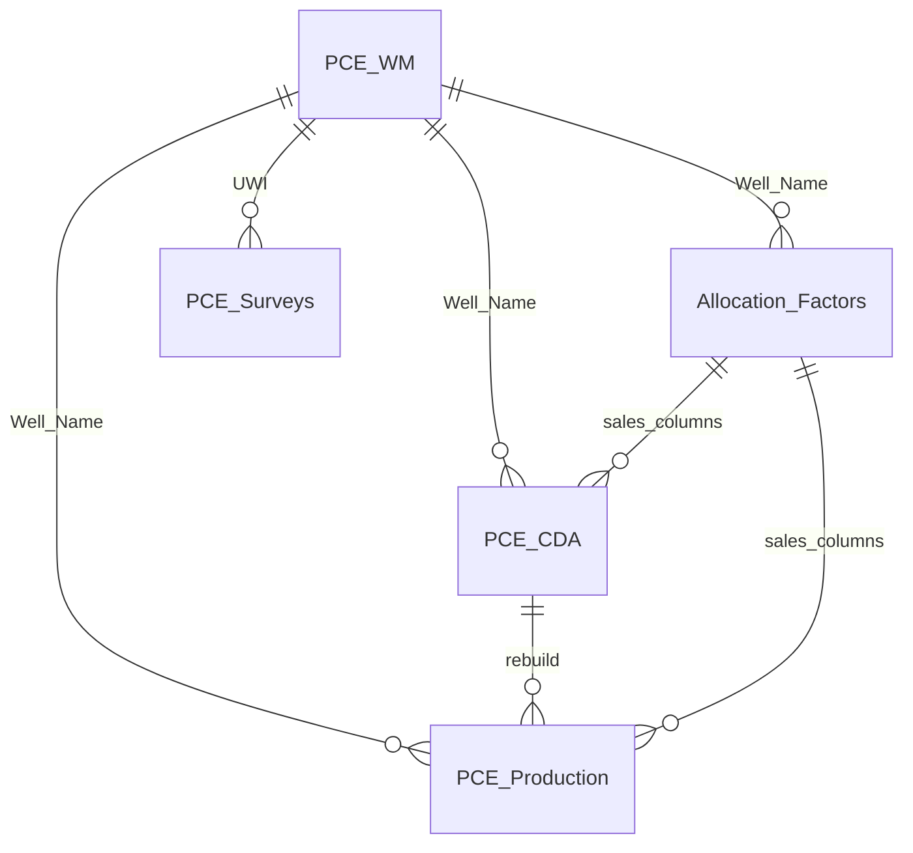
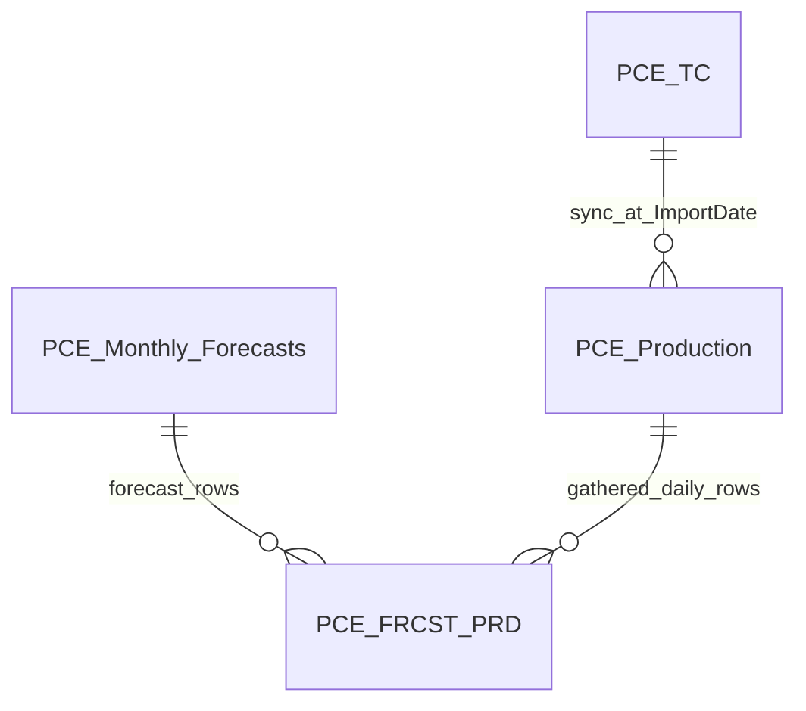

# Production Update System — User Guide

**Organization:** Pacific Canbriam Energy LTD  
**Document version:** 2.0  
**Last updated:** May 2026  
**Audience:** Operations staff who run production updates, allocations, imports, and exports  

---

> **For document conversion (Claude → Word):** Convert this markdown to a professional Word document for Pacific Canbriam Energy. Use company branding if available. Replace each `[IMAGE: …]` with a bordered placeholder box and caption. Render Mermaid diagrams as figures. Use a table of contents, page numbers, and keep language accessible for operations staff (not developers).

---

## Table of contents

1. [Introduction](#1-introduction)
2. [Before you start](#2-before-you-start)
3. [How data fits together](#3-how-data-fits-together)
4. [Main window overview](#4-main-window-overview)
5. [Keeping everything up to date](#5-keeping-everything-up-to-date)
6. [Module guides](#6-module-guides)
7. [Monthly runbook checklist](#7-monthly-runbook-checklist)
8. [Troubleshooting](#8-troubleshooting)
9. [Glossary](#9-glossary)
10. [Appendix A — Screenshot checklist](#appendix-a--screenshot-checklist)
11. [Appendix B — SQL schema reference](#appendix-b--sql-schema-reference)

---

## 1. Introduction

The **Production Update System** is a desktop application used at Pacific Canbriam Energy to keep reservoir and production reporting data current. It connects to:

- **SQL Server** — where well master, daily production, allocations, surveys, type curves, and forecasts are stored
- **Snowflake (Prodview)** — where daily meter and allocation source data is pulled from
- **Excel workbooks** — ValNav, Accumap, surveys, type curves, and monthly forecasts
- **Whitson+** — optional push of production history to the reservoir modelling platform

When you launch the app, you are asked for an **application password** before the main window opens. Contact your team lead if you need access.

[IMAGE: Application password dialog on startup]

**What you can do from the main window:**

| # | Operation |
|---|-----------|
| 1 | Well Master List |
| 2 | Prodview / Snowflake — Daily Production Retrieve |
| 3 | ValNav Monthly Update (Sales + NGL) |
| 4 | Public Sales Data and Ratios |
| 5 | Survey Data Import |
| 6 | Type Curves Import |
| 7 | Monthly Forecasts Import |
| 8 | Whitson+ Mass Upload |
| 9 | Exports / Reports |

Settings (SQL server, database, and file paths) are available from the **Settings** button in the operations header.

---

## 2. Before you start

### Prerequisites

- **Windows** PC on the company network
- Access to the **SQL Server** database (Windows authentication)
- **Snowflake / Prodview** access when running daily production refresh or importing new wells from Snowflake (VPN may be required — confirm with IT)
- **ODBC Driver 17 or 18** for SQL Server installed
- Application folder containing:
  - **`settings.ini`** — SQL display names and default Excel paths (often on a shared drive; same paths for most users)
  - **`.env`** — Snowflake credentials (copy from `.env.example`; do not share passwords)

[IMAGE: Settings dialog — SQL server, database, and file paths]

### Configuration files

| File | Purpose |
|------|---------|
| `settings.ini` | SQL server/database and paths to ValNav, Accumap, Survey, Type Curves, Whitson, and Monthly Forecasts workbooks |
| `.env` | Snowflake account, user, password, warehouse, database, schema, role; optional SQL overrides |
| `settings.ini.example` | Template for new installations |
| `.env.example` | Template for Snowflake and SQL variable names |

### Running the app

**Deployed build:** Run `ProductionUpdate.exe` from the folder that includes `_internal`, `images`, `settings.ini`, and `.env`.

**From source (developers / IT):**

```text
python -m pip install -r requirements.txt
python production_update_gui.py
```

---

## 3. How data fits together

Think of **`PCE_WM` (Well Master)** as the hub. Every well that receives daily production or monthly allocations should exist here with the correct **Well Name** and Snowflake identifiers (**GasIDREC**, **PressuresIDREC**).

### Main tables (plain language)

| Table | What it holds |
|-------|----------------|
| **PCE_WM** | Well list: names, UWI, pad, formation, Enersight name, Snowflake IDs, exception flag |
| **PCE_CDA** | Daily production rows from Snowflake (wellhead rates, gathered rates, pressures, allocation-painted sales columns) |
| **PCE_Production** | Reporting history built from CDA: sequences, cumulatives, monthly averages, NGL ratios, sales columns |
| **Allocation_Factors** | Monthly allocation inputs — **ValNav (PA)**, **NGL Excel (terminal bulk load)**, and **Accumap (Public Sales)**; includes UWI and monthly NGL volumes |
| **PCE_Surveys** | Directional survey stations (MD, TVD, east/north, etc.) |
| **PCE_TC** | Type-curve metrics imported from Excel |
| **PCE_Monthly_Forecasts** | Monthly forecast rows from the forecasts workbook |
| **PCE_FRCST_PRD** | Combined reporting table: all forecasts plus gathered daily production (for charts/exports) |
| **PCE_NGL_Daily_Staging** | Temporary staging used during ValNav NGL load (not for reporting directly) |

### Core data flow



Snowflake daily data flows: **Snowflake → PCE_CDA → PCE_Production**. Monthly Excel files update **Allocation_Factors**, which then paint sales-related and NGL ratio columns onto CDA and Production.

### Reporting and forecasts



[IMAGE: ER diagram export — optional rendered figure for Word document]

### Who updates which sales columns?

| Source | Module | What it updates on CDA / Production |
|--------|--------|-------------------------------------|
| **ValNav** | ValNav Monthly Update (Sales + NGL) | S2 gas production, condensate sales; monthly NGL ratio columns on Production |
| **Accumap** | Public Sales Data and Ratios | Gas sales production, sales CGR (and syncs all four sales columns on Production from CDA) |

**Important:** PA and Public Sales are **not** interchangeable. Run **both** when you need a complete sales picture for a month.

---

## 4. Main window overview

The main window title is **Production Update System**. The operations panel lists nine actions plus **Settings**.

[IMAGE: Main window — full screen showing all nine operation buttons and Settings]

Button order (top to bottom):

1. Well Master List  
2. Prodview / Snowflake — Daily Production Retrieve  
3. ValNav Monthly Update (Sales + NGL)  
4. Public Sales Data and Ratios  
5. Survey Data Import  
6. Type Curves Import  
7. Monthly Forecasts Import  
8. Whitson+ Mass Upload  
9. Exports / Reports  

Each button opens a dedicated dialog. Long-running jobs show progress and a log in that dialog.

---

## 5. Keeping everything up to date

This is the recommended mental model for staying current. **Confirm the exact refresh cadence (daily vs weekly Prodview) with your reservoir engineering team.**

### Recommended order

```
Settings → Well Master (if needed) → Prodview → ValNav (PA) → Public Sales → [optional imports] → Exports / Whitson
```

| Step | When to run | What gets updated |
|------|-------------|-------------------|
| **Well Master** | New wells, name/UWI/pad changes | `PCE_WM` only — **does not** load production by itself |
| **Prodview quick update** | Routine refresh (often each business day) | Snowflake → `PCE_CDA` (~18-month window) → rebuild `PCE_Production` → `PCE_FRCST_PRD` |
| **Prodview full rebuild** | Serious data problems or full realignment | All CDA history → full `PCE_Production` rebuild |
| **NGL bulk load (terminal)** | Once per NGL Excel refresh, or when loading history | `Allocation_Factors` NGL volumes + UWI (`scripts/ngl_allocation_load.py`) |
| **ValNav (PA)** | Monthly ValNav file is ready | `Allocation_Factors` (all PCE_WM wells), S2/condensate sales; applies NGL ratios from AF |
| **Public Sales** | Accumap file is ready | Gas sales and sales CGR for month range |
| **Surveys / Type Curves / Forecasts** | When those Excel files change | Respective tables; forecasts and Prodview also refresh `PCE_FRCST_PRD` |
| **Whitson+** | When reservoir model needs latest production | Reads `PCE_Production`; pushes to Whitson API (no SQL table changes) |

### Prodview: quick update vs full rebuild

| | Quick update (default) | Full rebuild |
|---|------------------------|--------------|
| **Typical time** | ~5 minutes | 15+ minutes on large history |
| **Snowflake scope** | ~18 calendar months rolling window | Full history per well (first production through today − 2) |
| **Use when** | Normal daily/weekly refresh | CDA and Production are broadly wrong, or after major fixes |
| **Also rebuilds** | `PCE_FRCST_PRD` | `PCE_FRCST_PRD` |

[IMAGE: Prodview dialog — quick vs full rebuild radio buttons]

### Prodview 2-day lag

Production is only loaded through **today minus 2 days**. Very recent days may appear blank until Prodview data is complete. This is intentional and matches the same rule used in forecast gathered slices and exports.

### After adding new wells

1. Import or edit the well in **Well Master** (including Snowflake IDs).  
2. Run **Prodview** (quick update is usually enough) so `PCE_CDA` and `PCE_Production` populate.  
3. When monthly files are ready, run **ValNav** and **Public Sales** for affected months.

Skipping step 2 is a common reason new wells show no production.

### Month-close sequence

When closing a production month:

1. Confirm Prodview has run through the effective end date.  
2. If NGL Excel changed, run the **terminal bulk load** into `Allocation_Factors` (see §6.3).  
3. Run **ValNav Monthly Update** for that month (applies S2/cond sales and NGL ratios from AF).  
4. Run **Public Sales** for the same month range (dialog reminds you to run PA first).  
5. Import **Monthly Forecasts** or **Type Curves** if those files updated.  
6. Run **Exports** or **Whitson+** if needed for reporting or modelling.

---

## 6. Module guides

### 6.1 Well Master List

**When to run:** Adding wells, fixing well names/UWI/pad metadata, reviewing the active well list, importing new wells from Snowflake.

**What changes:** `PCE_WM`. Removing a well can also purge its rows from CDA, Production, Allocation_Factors, and Surveys (confirm prompts).

**Typical duration:** Seconds to a few minutes depending on action.

[IMAGE: Well Master dialog — well table and Import New Wells]

**Common mistakes:**
- Expecting production to appear immediately after WM import — run **Prodview** next.
- Mismatched **Well Name** between WM and Snowflake — daily load may skip the well.

---

### 6.2 Prodview / Snowflake — Daily Production Retrieve

**When to run:** Routine production refresh; after Well Master changes; when CDA/Production look stale.

**What changes:** `PCE_CDA`, `PCE_Production`, type-curve sync to production, `PCE_FRCST_PRD`.

**Modes:**
- **Snowflake → CDA + production rebuild** (default, ~5 min)
- **Full rebuild — PCE_Production from all PCE_CDA** (heavy, 15+ min)

**Typical duration:** 5–20+ minutes.

[IMAGE: Prodview dialog — SQL status, mode selection, Run Update]

**Common mistakes:**
- Using full rebuild for routine updates (unnecessary load on SQL and Snowflake).
- Running ValNav/Public Sales before Prodview when daily wellhead data is missing.

---

### 6.3 ValNav Monthly Update (Sales + NGL)

**When to run:** When the monthly **ValNav** workbook is finalized for a given month.

**Two-step NGL flow:**

1. **Bulk load NGL Excel → Allocation_Factors (terminal, as needed)**  
   Run once in SSMS if columns are missing: `scripts/add_allocation_factors_ngl_columns.sql`  
   Then from a command prompt in the application folder:

   ```text
   python scripts/ngl_allocation_load.py --excel "path\to\NGL_export.xlsx"
   ```

   Excel format: header on **row 3**; columns `PRODUCTION_DATE` (YYYYMM), `UWI`, `NGL-C2` … `NGL-C5`, `PA_NGLs`.  
   UWI is matched to `PCE_WM.[Well Name]` (same rules as ValNav PA). Use `--dry-run` to preview matches.

2. **ValNav Monthly Update (GUI)** — select month and run **Run Monthly Loader**  
   Loads ValNav S2/condensate into `Allocation_Factors` for **every** `PCE_WM` well (zero stubs where ValNav has no row), preserves existing NGL volumes and `Sales_Gas`, then applies daily NGL `_R` columns to `PCE_Production` from `Allocation_Factors`.

**What changes:** `Allocation_Factors` (UWI, ValNav columns, preserved NGL volumes), `PCE_CDA` and `PCE_Production` (S2 gas, condensate sales), daily NGL ratio columns on `PCE_Production` for that month via `PCE_NGL_Daily_Staging`.

**Typical duration:** A few minutes per month (bulk NGL load depends on Excel size).

[IMAGE: ValNav Monthly Update dialog — month picker and Run Monthly Loader]

**Common mistakes:**
- Skipping Prodview first — PA needs current CDA rows.
- Assuming PA updates gas **sales** — that is **Public Sales** (Accumap).
- Running ValNav before bulk NGL load — NGL ratios will be skipped if AF has no NGL volumes for the month.

---

### 6.4 Public Sales Data and Ratios

**When to run:** When the **Accumap** workbook is ready; use **From/To** months for a range.

**What changes:** `Allocation_Factors` (Accumap gas sales), `PCE_CDA` (gas sales, sales CGR), full four-column sales sync on `PCE_Production`.

**Typical duration:** A few minutes per month in range.

[IMAGE: Public Sales dialog — month range and Accumap path]

**Common mistakes:**
- Running before **ValNav (PA)** for the same months — dialog warns you; condensate-dependent CGR may be wrong.
- Cancelling mid-run — completed months stay committed; remaining months are skipped.

---

### 6.5 Survey Data Import

**When to run:** New or updated survey Excel/CSV files.

**What changes:** `PCE_Surveys` (reads `PCE_WM` for UWI/name matching).

**Typical duration:** Depends on file size.

[IMAGE: Survey import dialog and optional column mapping dialog]

**Common mistakes:**
- UWIs in the survey file not matching Well Master.

---

### 6.6 Type Curves Import

**When to run:** Updated type-curve Excel workbook.

**What changes:** `PCE_TC`; materialized copy into `PCE_Production` at import date; `PCE_FRCST_PRD` rebuild.

**Modes:** Append selected wells from file, or delete selected wells from database.

[IMAGE: Type Curves import dialog — append and delete panels]

---

### 6.7 Monthly Forecasts Import

**When to run:** New forecast months arrive in the monthly forecasts workbook.

**What changes:** Appends to `PCE_Monthly_Forecasts` (replaces matching Date+UWI keys from the file); rebuilds `PCE_FRCST_PRD`. Separate **Remove selected months** action deletes forecast months without needing a new Excel file.

**Typical duration:** 1–5 minutes.

[IMAGE: Monthly Forecasts dialog — import and remove-months sections]

**Common mistakes:**
- Excel **Date** cells with no year (e.g. "Apr") — app warns before import; fix the file or confirm to proceed.
- Expecting remove-months to delete gathered daily rows in `PCE_FRCST_PRD` — rebuild preserves gathered production; only forecast slice is removed.

---

### 6.8 Whitson+ Mass Upload

**When to run:** Production in SQL should be pushed to Whitson+ for modelling.

**What changes:** None in SQL Server — reads `PCE_Production` and `PCE_WM`, posts to Whitson+ API. Well attributes (pad, formation, lateral length, Layer Producer, etc.) sync on each push.

**One-time setup:** Create a **Text, manual** custom attribute named **Layer Producer** in the Whitson UI before first use.

[IMAGE: Whitson+ Mass Upload dialog — project ID and Post Data]

**Common mistakes:**
- Missing Layer Producer custom attribute in Whitson (403 error).
- Stale SQL data — run **Prodview** and monthly loaders first.

---

### 6.9 Exports / Reports

**When to run:** Monthly gathered production Excel report is needed.

**What changes:** None in SQL — exports from `PCE_Production` and `PCE_WM` to Excel (metric or imperial units).

[IMAGE: Exports dialog — month range and Export to Excel]

---

## 7. Monthly runbook checklist

Use this at month-close (adjust dates to your process):

- [ ] Prodview quick update completed through effective end date (today − 2 days)
- [ ] New wells in Well Master have been followed by Prodview
- [ ] NGL Excel bulk-loaded to Allocation_Factors if volumes changed (`scripts/ngl_allocation_load.py`)
- [ ] ValNav Monthly Update run for closed month
- [ ] Public Sales run for same month(s) after PA
- [ ] Monthly Forecasts imported if workbook updated
- [ ] Type Curves updated if applicable
- [ ] Exports generated if required
- [ ] Whitson+ push if reservoir team needs latest data
- [ ] Spot-check one well in SQL or export for expected rates and sales columns

---

## 8. Troubleshooting

| Symptom | What to try |
|---------|-------------|
| Password dialog will not accept entry | Confirm with team lead; password is managed internally |
| SQL connection failed | Check VPN, server name in Settings, Windows auth, ODBC driver |
| Snowflake / Prodview errors | Check `.env` credentials, VPN, warehouse availability |
| Well has no production rows | Confirm well is in `PCE_WM` with GasIDREC; run Prodview |
| New well still empty after WM | **Run Prodview** — WM alone does not load production |
| Public Sales warns missing PA | Run ValNav Monthly Update for same months first |
| NGL ratios all zero for month | Run `scripts/ngl_allocation_load.py` for that month first; then re-run ValNav Monthly Update; confirm UWI matching in NGL Excel |
| Forecast import date warnings | Fix Date column in Excel to include full year, or confirm import |
| Whitson 403 on Layer Producer | Create **Layer Producer** custom attribute in Whitson UI |
| Recent days blank in production | Expected — 2-day Prodview lag; wait or confirm with data team |
| Broadly wrong history everywhere | Prodview **full rebuild** (or `python production_update.py` CLI) |

---

## 9. Glossary

| Term | Meaning |
|------|---------|
| **UWI** | Unique Well Identifier |
| **CDA** | Central Data Archive — daily Snowflake-sourced rows in `PCE_CDA` |
| **PA / ValNav** | Production Accounting monthly loader from ValNav Excel |
| **Accumap / Public Sales** | Public sales gas data from Accumap Excel |
| **Prodview lag** | Data loaded only through today minus 2 days |
| **Quick update** | Default Prodview mode — ~18-month Snowflake window, ~5 min |
| **Full rebuild** | Prodview mode — entire CDA history, full Production rebuild |
| **Gathered production** | Measured gathered gas/condensate/water rates (vs forecast rows) |
| **PCE_FRCST_PRD** | Combined forecast + gathered table for reporting |
| **S2 gas** | Second-stage gas allocation column updated by ValNav |
| **Sales CGR** | Condensate-gas ratio on sales volumes (Public Sales path) |

---

## Appendix A — Screenshot checklist

Capture these for the Word document (replace `[IMAGE: …]` placeholders):

1. Password dialog  
2. Main window (all nine buttons visible)  
3. Settings dialog  
4. Well Master List  
5. Prodview dialog (quick mode selected)  
6. ValNav Monthly Update  
7. Public Sales Data and Ratios  
8. Survey Data Import  
9. Type Curves Import  
10. Monthly Forecasts Import (import + remove months sections)  
11. Whitson+ Mass Upload  
12. Exports / Reports  
13. ER diagrams (render Mermaid from Section 3)  

---

## Appendix B — SQL schema reference

Run the query below in **SQL Server Management Studio** against your production database. Export each result set and paste into the Word appendix (or keep as a linked spreadsheet).

**Tables in scope:** `PCE_WM`, `PCE_CDA`, `PCE_Production`, `Allocation_Factors`, `PCE_Surveys`, `PCE_TC`, `PCE_Monthly_Forecasts`, `PCE_FRCST_PRD`, `PCE_NGL_Daily_Staging`, `Well_Mapping`

```sql
/* PCE Production Update System — schema export for documentation */

-- 1) Tables: row counts and dates
SELECT
    s.name AS schema_name,
    t.name AS table_name,
    p.rows AS approx_row_count,
    t.create_date,
    t.modify_date
FROM sys.tables t
JOIN sys.schemas s ON t.schema_id = s.schema_id
JOIN sys.partitions p ON t.object_id = p.object_id AND p.index_id IN (0, 1)
WHERE t.name IN (
    'PCE_WM', 'PCE_CDA', 'PCE_Production', 'Allocation_Factors',
    'PCE_Surveys', 'PCE_TC', 'PCE_Monthly_Forecasts', 'PCE_FRCST_PRD',
    'PCE_NGL_Daily_Staging', 'Well_Mapping'
)
ORDER BY t.name;

-- 2) Columns
SELECT
    c.TABLE_SCHEMA,
    c.TABLE_NAME,
    c.ORDINAL_POSITION,
    c.COLUMN_NAME,
    c.DATA_TYPE,
    c.CHARACTER_MAXIMUM_LENGTH,
    c.NUMERIC_PRECISION,
    c.NUMERIC_SCALE,
    c.IS_NULLABLE,
    c.COLUMN_DEFAULT
FROM INFORMATION_SCHEMA.COLUMNS c
WHERE c.TABLE_NAME IN (
    'PCE_WM', 'PCE_CDA', 'PCE_Production', 'Allocation_Factors',
    'PCE_Surveys', 'PCE_TC', 'PCE_Monthly_Forecasts', 'PCE_FRCST_PRD',
    'PCE_NGL_Daily_Staging', 'Well_Mapping'
)
ORDER BY c.TABLE_NAME, c.ORDINAL_POSITION;

-- 3) Primary keys and unique constraints
SELECT
    tc.TABLE_NAME,
    tc.CONSTRAINT_TYPE,
    tc.CONSTRAINT_NAME,
    kcu.COLUMN_NAME,
    kcu.ORDINAL_POSITION
FROM INFORMATION_SCHEMA.TABLE_CONSTRAINTS tc
JOIN INFORMATION_SCHEMA.KEY_COLUMN_USAGE kcu
    ON tc.CONSTRAINT_NAME = kcu.CONSTRAINT_NAME
WHERE tc.TABLE_NAME IN (
    'PCE_WM', 'PCE_CDA', 'PCE_Production', 'Allocation_Factors',
    'PCE_Surveys', 'PCE_TC', 'PCE_Monthly_Forecasts', 'PCE_FRCST_PRD',
    'PCE_NGL_Daily_Staging', 'Well_Mapping'
)
AND tc.CONSTRAINT_TYPE IN ('PRIMARY KEY', 'UNIQUE')
ORDER BY tc.TABLE_NAME, tc.CONSTRAINT_TYPE, kcu.ORDINAL_POSITION;

-- 4) Foreign keys
SELECT
    fk.name AS fk_name,
    OBJECT_NAME(fk.parent_object_id) AS child_table,
    pc.name AS child_column,
    OBJECT_NAME(fk.referenced_object_id) AS parent_table,
    rc.name AS parent_column
FROM sys.foreign_keys fk
JOIN sys.foreign_key_columns fkc ON fk.object_id = fkc.constraint_object_id
JOIN sys.columns pc ON fkc.parent_object_id = pc.object_id AND fkc.parent_column_id = pc.column_id
JOIN sys.columns rc ON fkc.referenced_object_id = rc.object_id AND fkc.referenced_column_id = rc.column_id
WHERE OBJECT_NAME(fk.parent_object_id) IN (
    'PCE_WM', 'PCE_CDA', 'PCE_Production', 'Allocation_Factors',
    'PCE_Surveys', 'PCE_TC', 'PCE_Monthly_Forecasts', 'PCE_FRCST_PRD',
    'PCE_NGL_Daily_Staging', 'Well_Mapping'
)
OR OBJECT_NAME(fk.referenced_object_id) IN (
    'PCE_WM', 'PCE_CDA', 'PCE_Production', 'Allocation_Factors',
    'PCE_Surveys', 'PCE_TC', 'PCE_Monthly_Forecasts', 'PCE_FRCST_PRD',
    'PCE_NGL_Daily_Staging', 'Well_Mapping'
)
ORDER BY child_table, fk_name;

-- 5) Indexes
SELECT
    OBJECT_NAME(i.object_id) AS table_name,
    i.name AS index_name,
    i.is_unique,
    i.is_primary_key,
    STRING_AGG(c.name, ', ') WITHIN GROUP (ORDER BY ic.key_ordinal) AS key_columns
FROM sys.indexes i
JOIN sys.index_columns ic ON i.object_id = ic.object_id AND i.index_id = ic.index_id
JOIN sys.columns c ON ic.object_id = c.object_id AND ic.column_id = c.column_id
WHERE OBJECT_NAME(i.object_id) IN (
    'PCE_WM', 'PCE_CDA', 'PCE_Production', 'Allocation_Factors',
    'PCE_Surveys', 'PCE_TC', 'PCE_Monthly_Forecasts', 'PCE_FRCST_PRD',
    'PCE_NGL_Daily_Staging', 'Well_Mapping'
)
GROUP BY i.object_id, i.name, i.is_unique, i.is_primary_key
ORDER BY table_name, index_name;
```

**Paste exported results below this line when building the final Word document:**

<!-- RESULT SET 1: Table inventory -->
<!-- RESULT SET 2: Columns -->
<!-- RESULT SET 3: Keys -->
<!-- RESULT SET 4: Foreign keys -->
<!-- RESULT SET 5: Indexes -->

---

## Appendix C — Building the Windows executable (IT)

For packaging only — operators normally use the deployed `.exe`.

1. Use 64-bit Python on a build PC.  
2. `pip install -r requirements.txt` and `pip install -r requirements-dev.txt`  
3. `pyinstaller --clean ProductionUpdate.spec`  
4. Ship the entire `dist/ProductionUpdate/` folder including `_internal`, `images`, `settings.ini`, and `.env`.

---

*Internal use — Pacific Canbriam Energy LTD. Support and change control per company IT and reservoir engineering practice.*
