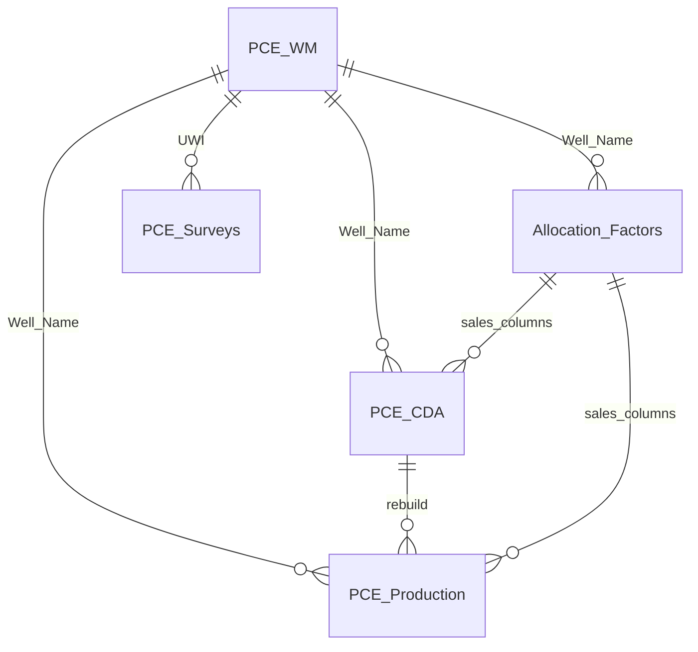
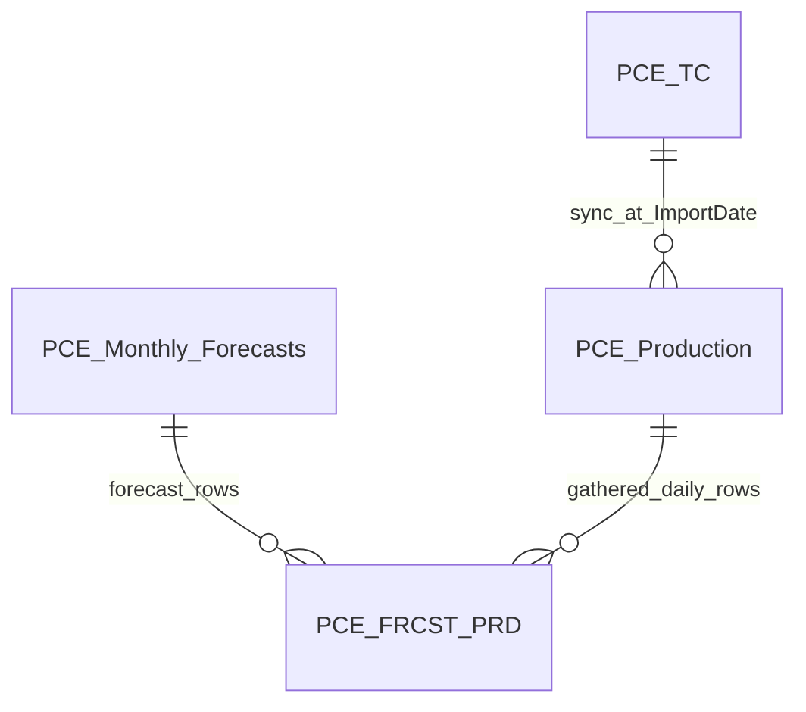

# Production Update System — User Guide

**Organization:** Pacific Canbriam Energy LTD  
**Document version:** 2.1  
**Last updated:** June 2026  
**Audience:** Operations staff who run production updates, allocations, imports, and exports  

---

> **For document conversion (Claude → Word):** Convert this markdown to a professional Word document for Pacific Canbriam Energy. Use company branding if available. Replace each `[IMAGE: …]` with a bordered placeholder box and caption. Render Mermaid diagrams as figures. Use a table of contents, page numbers, and keep language accessible for operations staff (not developers).

---

## Table of contents

1. [Introduction](#1-introduction)
2. [Before you start](#2-before-you-start)
3. [How data fits together](#3-how-data-fits-together)
4. [Main window overview](#4-main-window-overview)
5. [Keeping everything up to date](#5-keeping-everything-up-to-date)
6. [Module guides](#6-module-guides)
7. [Monthly runbook checklist](#7-monthly-runbook-checklist)
8. [Troubleshooting](#8-troubleshooting)
9. [Glossary](#9-glossary)
10. [Appendix A — Screenshot checklist](#appendix-a--screenshot-checklist)
11. [Appendix B — SQL schema reference](#appendix-b--sql-schema-reference)

---

## 1. Introduction

The **Production Update System** is a desktop application used at Pacific Canbriam Energy to keep reservoir and production reporting data current. It connects to:

- **SQL Server** — where well master, daily production, allocations, surveys, type curves, and forecasts are stored
- **Snowflake (Prodview)** — where daily meter and allocation source data is pulled from
- **Excel workbooks** — ValNav, Accumap, surveys, type curves, and monthly forecasts
- **Whitson+** — optional push of production history to the reservoir modelling platform

When you launch the app, you are asked for an **application password** before the main window opens. Contact your team lead if you need access.

[IMAGE: Application password dialog on startup]

**What you can do from the main window:**

| # | Operation |
|---|-----------|
| 1 | Well Master List |
| 2 | Prodview / Snowflake — Daily Production Retrieve |
| 3 | ValNav Monthly Update (Sales + NGL) |
| 4 | Public Sales Data and Ratios |
| 5 | Survey Data Import |
| 6 | Type Curves Import |
| 7 | Monthly Forecasts Import |
| 8 | Exports / Reports |
| 9 | Whitson+ Mass Upload |

**Settings** (SQL server, database, file paths) is in the **RE Production System Actions** panel header. **Credits** opens engineering and design credits. The footer shows vendor attribution.

---

## 2. Before you start

### Prerequisites

- **Windows** PC on the company network
- Access to the **SQL Server** database (Windows authentication)
- **Snowflake / Prodview** access when running daily production refresh or importing new wells from Snowflake (VPN may be required — confirm with IT)
- **ODBC Driver 17 or 18** for SQL Server installed
- Application folder containing:
  - **`settings.ini`** — `[SQL]` server/database, `[WHITSON]` API credentials (required for Whitson+ Mass Upload), and `[PATHS]` Excel workbook locations (often on a shared drive; same paths for most users)
  - **`.env`** — Snowflake credentials (copy from `.env.example`; do not share passwords)

[IMAGE: Settings dialog — SQL server, database, and file paths]

### Configuration files

| File | Purpose |
|------|---------|
| `settings.ini` | `[SQL]` server/database; `[WHITSON]` client, client_id, client_secret, project_id (and optional `ca_bundle` for corporate SSL); `[PATHS]` to ValNav, Accumap, Survey, Type Curves, Whitson, and Monthly Forecasts workbooks |
| `.env` | Snowflake account, user, password, warehouse, database, schema, role; optional SQL overrides |
| `settings.ini.example` | Template for new installations |
| `.env.example` | Template for Snowflake and SQL variable names |
| `whitson_imperial.ini` | Metric-to-imperial conversion factors for Whitson+ production push (shipped with the app) |

### Running the app

**Deployed build:** Run **`PCE_RE_Production_Update V2.4.exe`** from the folder that includes `_internal`, `images`, `settings.ini`, `whitson_imperial.ini`, `survey_mapping_presets.json`, and `.env`.

**From source in VSCode (developers / IT):**

1. Open the project folder in VSCode.
2. Create a virtual environment and select it as the Python interpreter.
3. `pip install -r requirements.txt`
4. Copy `settings.ini.example` → `settings.ini` and `.env.example` → `.env`; fill in real values.
5. Run **`production_update_gui.py`** (Run Python File or integrated terminal).

---

## 3. How data fits together

Think of **`PCE_WM` (Well Master)** as the hub. Every well that receives daily production or monthly allocations should exist here with the correct **Well Name** and Snowflake identifiers (**GasIDREC**, **PressuresIDREC**).

### Main tables (plain language)

| Table | What it holds |
|-------|----------------|
| **PCE_WM** | Well list: names, UWI, pad, formation, Enersight name, Snowflake IDs, exception flag |
| **PCE_CDA** | Daily production rows from Snowflake (wellhead rates, gathered rates, pressures, allocation-painted sales columns) |
| **PCE_Production** | Reporting history built from CDA: sequences, cumulatives, monthly averages, NGL ratios, sales columns |
| **Allocation_Factors** | Monthly allocation inputs — **ValNav (PA)**, **NGL Excel (terminal bulk load)**, and **Accumap (Public Sales)**; includes UWI and monthly NGL volumes |
| **PCE_Surveys** | Directional survey stations (MD, TVD, east/north, etc.) |
| **PCE_TC** | Type-curve metrics imported from Excel |
| **PCE_Monthly_Forecasts** | Monthly forecast rows from the forecasts workbook |
| **PCE_FRCST_PRD** | Combined reporting table: all forecasts plus gathered daily production (for charts/exports) |
| **PCE_NGL_Daily_Staging** | Temporary staging used during ValNav NGL load (not for reporting directly) |

### Core data flow



Snowflake daily data flows: **Snowflake → PCE_CDA → PCE_Production**. Monthly Excel files update **Allocation_Factors**, which then paint sales-related and NGL ratio columns onto CDA and Production.

### Reporting and forecasts



[IMAGE: ER diagram export — optional rendered figure for Word document]

### Who updates which sales columns?

| Source | Module | What it updates on CDA / Production |
|--------|--------|-------------------------------------|
| **ValNav** | ValNav Monthly Update (Sales + NGL) | S2 gas production, condensate sales; monthly NGL ratio columns on Production |
| **Accumap** | Public Sales Data and Ratios | Gas sales production, sales CGR (and syncs all four sales columns on Production from CDA) |

**Important:** PA and Public Sales are **not** interchangeable. Run **both** when you need a complete sales picture for a month.

---

## 4. Main window overview

The main window title is **Pacific Canbriam Energy - Reservoir Production Update System**. The header shows the company logo, **Credits**, and a card with the application name. Below that, the **RE Production System Actions** panel lists nine operation buttons and **Settings** in the panel header row. The footer shows **Adobel Services Inc ©**.

[IMAGE: Main window — full screen showing header, RE Production System Actions panel, all nine operation buttons, Settings, and footer]

Button order (top to bottom):

1. Well Master List  
2. Prodview / Snowflake — Daily Production Retrieve  
3. ValNav Monthly Update (Sales + NGL)  
4. Public Sales Data and Ratios  
5. Survey Data Import  
6. Type Curves Import  
7. Monthly Forecasts Import  
8. Exports / Reports  
9. Whitson+ Mass Upload  

Each button opens a dedicated dialog. Long-running jobs show progress and a log in that dialog.

---

## 5. Keeping everything up to date

This is the recommended mental model for staying current. **Confirm the exact refresh cadence (daily vs weekly Prodview) with your reservoir engineering team.**

### Recommended order

```
Settings → Well Master (if needed) → Prodview → ValNav (PA) → Public Sales → [optional imports] → Exports / Whitson
```

| Step | When to run | What gets updated |
|------|-------------|-------------------|
| **Well Master** | New wells, name/UWI/pad changes | `PCE_WM` only — **does not** load production by itself |
| **Prodview routine update** | Routine refresh (often each business day) | Snowflake → `PCE_CDA` (~18-month window) → rebuild `PCE_Production` → `PCE_FRCST_PRD` |
| **Prodview full rebuild** | Serious data problems or full realignment | All CDA history → full `PCE_Production` rebuild |
| **ValNav (PA)** | Monthly ValNav file is ready | `Allocation_Factors` (S2/cond/NGL from ValNav sheet, all PCE_WM wells), sales apply; daily NGL ratios on Production |
| **Public Sales** | Accumap file is ready | Gas sales and sales CGR for month range |
| **Surveys / Type Curves / Forecasts** | When those Excel files change | Respective tables; **Monthly Forecasts** and **Prodview** refresh `PCE_FRCST_PRD` (Type Curves does not) |
| **Whitson+** | When reservoir model needs latest production | Reads `PCE_Production`; pushes to Whitson API (no SQL table changes) |

### Prodview: routine update vs full rebuild

| | Routine update (default) | Full rebuild |
|---|--------------------------|--------------|
| **Dialog label** | Routine update — Snowflake → CDA + production (~18 months) | Full rebuild — PCE_Production from all PCE_CDA |
| **Typical time** | ~5 minutes | 15+ minutes on large history |
| **Snowflake scope** | ~18 calendar months rolling window | Full history per well (first production through today − 2) |
| **PCE_Production** | Replaces rows **only inside** the rolling window (~18 mo through today − 2); older production history is kept | Full delete and rebuild from all CDA |
| **Use when** | Normal daily/weekly refresh | CDA and Production are broadly wrong, or after major fixes |
| **Also rebuilds** | `PCE_FRCST_PRD` (NGL, UWI, pad, and type-curve sync preserved) | `PCE_FRCST_PRD` (same post-rebuild steps) |

[IMAGE: Prodview dialog — routine update vs full rebuild radio buttons]

### Prodview 2-day lag

Production is only loaded through **today minus 2 days**. Very recent days may appear blank until Prodview data is complete. This is intentional and matches the same rule used in forecast gathered slices and exports.

### After adding new wells

1. Import or edit the well in **Well Master** (including Snowflake IDs).  
2. Run **Prodview** (routine update is usually enough) so `PCE_CDA` and `PCE_Production` populate.  
3. When monthly files are ready, run **ValNav** and **Public Sales** for affected months.

Skipping step 2 is a common reason new wells show no production.

### Month-close sequence

When closing a production month:

1. Confirm Prodview has run through the effective end date.  
2. Run **ValNav Monthly Update** for that month (loads S2/cond/NGL into AF and applies daily NGL ratios).  
3. Run **Public Sales** for the same month range (dialog reminds you to run PA first).  
4. Import **Monthly Forecasts** or **Type Curves** if those files updated.  
5. Run **Exports** or **Whitson+** if needed for reporting or modelling.

---

## 6. Module guides

### 6.1 Well Master List

**When to run:** Adding wells, fixing well names/UWI/pad metadata, reviewing the active well list, importing new wells from Snowflake.

**What changes:** `PCE_WM`. Removing a well can also purge its rows from CDA, Production, Allocation_Factors, and Surveys (confirm prompts).

**Opening vs Refresh:** When you first open Well Master, the app loads wells from the database **without** recomputing Composite Name (faster startup). Click **Refresh** to reload from the database **and** recompute **Composite Name** from Well Name, Layer Producer, Completions Technology, and Orient for all active wells. The status bar may report how many composite names were updated.

**Save and background work:** Save, staged updates, and database reloads run on background workers so the dialog stays responsive. Toolbar buttons (Save, Refresh, Export, Import, Remove) are disabled while a load or save is in progress. If you try to save while another save is running, the app shows **A save is already in progress.**

**Refresh vs Save:** Editing well parts in the grid does **not** update Composite Name until you click **Save** (for checked wells) or run **Refresh** (bulk recompute for all wells). Do not expect composite names to fix themselves on every open.

**Additional Fields:** After running `scripts/add_pce_wm_additional_fields.sql` on the database, scroll to the rightmost **Additional Fields** column and click **Fields…** on a checked well to edit coordinates, UTM, elevations, tubing, and dates. Values are stored in `PCE_WM` only (not in the main grid). Surface and bottom hole lat/long are pushed to Whitson+ on the next mass upload.

**Bulk backfill:** To load many wells from Excel (row 2 headers, row 3+ data, UWI in column A), run `python scripts/backfill_wm_additional_fields.py path/to/file.xlsx` after the SQL migration is applied.

**Typical duration:** Seconds to a few minutes depending on action.

[IMAGE: Well Master dialog — well table and Import New Wells]

**Common mistakes:**
- Expecting production to appear immediately after WM import — run **Prodview** next.
- Mismatched **Well Name** between WM and Snowflake — daily load may skip the well.

---

### 6.2 Prodview / Snowflake — Daily Production Retrieve

**When to run:** Routine production refresh; after Well Master changes; when CDA/Production look stale.

**What changes:** `PCE_CDA`, `PCE_Production`, type-curve sync to production, `PCE_FRCST_PRD`.

**Well Master propagation on Prodview:** After each routine update or full rebuild, `PCE_WM` is the source of truth for production metadata. `[UWI]` is written on every new production row at insert time (from WM) and refreshed again from WM before NGL ratios run, so UWI is not left blank after a table clear. `[Pad Name]` on gathered production is WM pad plus ` PRD` (e.g. `15-12 PRD`) so forecast pads in `PCE_FRCST_PRD` stay distinct. `Allocation_Factors.[UWI]` is also aligned to WM on rebuild. ValNav/Excel UWIs that differ only by a leading digit (e.g. `02/...` vs `202/...`) still match the same well.

**Modes (match dialog radio labels):**
- **Routine update — Snowflake → CDA + production (~18 months)** (default, ~5 min)
- **Full rebuild — PCE_Production from all PCE_CDA** (heavy, 15+ min)

**Typical duration:** 5–20+ minutes.

[IMAGE: Prodview dialog — SQL status, mode selection, Run Update]

**Common mistakes:**
- Using full rebuild for routine updates (unnecessary load on SQL and Snowflake).
- Running ValNav/Public Sales before Prodview when daily wellhead data is missing.

---

### 6.3 ValNav Monthly Update (Sales + NGL)

**When to run:** When the monthly **ValNav** workbook is finalized for a given month.

**NGL flow (monthly):**

1. Run once in SSMS if columns are missing: `scripts/add_allocation_factors_ngl_columns.sql`

2. **ValNav Monthly Update (GUI)** — select month and run **Run Monthly Loader**  
   Reads **NGL-C2, NGL-C3, NGL-C4, NGL-C5, and NGLs** from the ValNav worksheet for that month (same sheet as S2 gas and condensate), writes them to `Allocation_Factors` (`NGL_C2`…`PA_NGLs`), then applies daily NGL `_R` columns to `PCE_Production`.

   Optional: `scripts/ngl_allocation_load.py` remains available for bulk historical loads from a dedicated NGL Excel export (not required for routine month-close).

**What changes:** `Allocation_Factors` (UWI, ValNav columns, preserved NGL volumes), `PCE_CDA` and `PCE_Production` (S2 gas, condensate sales), daily NGL ratio columns on `PCE_Production` for that month via `PCE_NGL_Daily_Staging`.

**Typical duration:** A few minutes per month (bulk NGL load depends on Excel size).

[IMAGE: ValNav Monthly Update dialog — month picker and Run Monthly Loader]

**Common mistakes:**
- Skipping Prodview first — PA needs current CDA rows.
- Assuming PA updates gas **sales** — that is **Public Sales** (Accumap).
- ValNav sheet missing NGL columns — NGL ratios skipped; confirm NGL-C2…C5 and NGLs exist on the month tab.

---

### 6.4 Public Sales Data and Ratios

**When to run:** When the **Accumap** workbook is ready; use **From/To** months for a range.

**What changes:** `Allocation_Factors` (Accumap gas sales), `PCE_CDA` (gas sales, sales CGR), full four-column sales sync on `PCE_Production`.

**Typical duration:** A few minutes per month in range.

[IMAGE: Public Sales dialog — month range and Accumap path]

**Common mistakes:**
- Running before **ValNav (PA)** for the same months — dialog warns you; condensate-dependent CGR may be wrong.
- Cancelling mid-run — completed months stay committed; remaining months are skipped.

---

### 6.5 Survey Data Import

**When to run:** New or updated survey Excel/CSV files.

**What changes:** `PCE_Surveys` (reads `PCE_WM` for UWI/name matching).

**Typical duration:** Depends on file size.

[IMAGE: Survey import dialog and optional column mapping dialog]

**Common mistakes:**
- UWIs in the survey file not matching Well Master.

---

### 6.6 Type Curves Import

**When to run:** Updated type-curve Excel workbook.

**What changes:** `PCE_TC`; materialized copy into `PCE_Production` at import date. Does **not** rebuild `PCE_FRCST_PRD` (type-curve wells are excluded from that reporting table; run Prodview or Monthly Forecasts import to refresh it).

**Gathered gas:** Type-curve rows do not read gathered volumes from Excel. On import, `[Gathered Gas (e³m³/d)]` and `[Gas Gathered Cumulative (e³m³)]` in `PCE_TC` and `PCE_Production` are set to the same values as Gas WH daily and Gas WH cumulative.

**Modes:** Append selected wells from file, or delete selected wells from database.

[IMAGE: Type Curves import dialog — append and delete panels]

---

### 6.7 Monthly Forecasts Import

**When to run:** New forecast months arrive in the monthly forecasts workbook.

**What changes:** Appends to `PCE_Monthly_Forecasts` (replaces matching Date+UWI keys from the file); rebuilds `PCE_FRCST_PRD`. Separate **Remove selected months** action deletes forecast months without needing a new Excel file.

**Typical duration:** 1–5 minutes.

[IMAGE: Monthly Forecasts dialog — import and remove-months sections]

**Common mistakes:**
- Excel **Date** cells with no year (e.g. "Apr") — app warns before import; fix the file or confirm to proceed.
- Expecting remove-months to delete gathered daily rows in `PCE_FRCST_PRD` — rebuild preserves gathered production; only forecast slice is removed.

---

### 6.8 Whitson+ Mass Upload

**When to run:** Production in SQL should be pushed to Whitson+ for modelling.

**What changes:** None in SQL Server — reads `PCE_Production` and `PCE_WM`, posts to Whitson+ API. Well attributes (pad, formation, lateral length, Layer Producer, surface lat/long, bottomhole toe lat/long, etc.) sync on each push.

**Coordinates:** Whitson surface coordinates use `PCE_WM.[Surface Hole Latitude]` / `[Surface Hole Longitude]` when set, otherwise legacy `[Surface Location Latitude (NAD83)]` / `[Surface Location Longitude (NAD83)]` (API fields `surf_lat` / `surf_long`). Bottomhole coordinates use `[Bottom Hole Latitude]` / `[Bottom Hole Longitude]` with the same NAD83 bottom columns as fallback (API fields `bothole_lat` / `bothole_long`). Edit these in Well Master → scroll right → **Additional Fields** → **Fields…** (one checked well at a time).

**One-time setup:** Create a **Text, manual** custom attribute named **Layer Producer** in the Whitson UI before first use.

[IMAGE: Whitson+ Mass Upload dialog — project ID and Post Data]

**Common mistakes:**
- Missing Layer Producer custom attribute in Whitson (403 error).
- Stale SQL data — run **Prodview** and monthly loaders first.

---

### 6.9 Exports / Reports

**When to run:** Monthly gathered production Excel report is needed.

**What changes:** None in SQL — exports from `PCE_Production` and `PCE_WM` to Excel (metric or imperial units).

[IMAGE: Exports dialog — month range and Export to Excel]

---

## 7. Monthly runbook checklist

Use this at month-close (adjust dates to your process):

- [ ] Prodview routine update completed through effective end date (today − 2 days)
- [ ] New wells in Well Master have been followed by Prodview
- [ ] ValNav Monthly Update run for closed month (includes NGL from ValNav sheet)
- [ ] Public Sales run for same month(s) after PA
- [ ] Monthly Forecasts imported if workbook updated
- [ ] Type Curves updated if applicable
- [ ] Exports generated if required
- [ ] Whitson+ push if reservoir team needs latest data
- [ ] Spot-check one well in SQL or export for expected rates and sales columns

---

## 8. Troubleshooting

| Symptom | What to try |
|---------|-------------|
| Password dialog will not accept entry | Confirm with team lead; password is managed internally |
| SQL connection failed | Check VPN, server name in Settings, Windows auth, ODBC driver |
| Snowflake / Prodview errors | Check `.env` credentials, VPN, warehouse availability |
| Well has no production rows | Confirm well is in `PCE_WM` with GasIDREC; run Prodview |
| New well still empty after WM | **Run Prodview** — WM alone does not load production |
| Public Sales warns missing PA | Run ValNav Monthly Update for same months first |
| NGL ratios all zero for month | Re-run ValNav Monthly Update; confirm month tab has NGL-C2…C5 and NGLs columns with data |
| Forecast import date warnings | Fix Date column in Excel to include full year, or confirm import |
| Whitson 403 on Layer Producer | Create **Layer Producer** custom attribute in Whitson UI |
| Whitson SSL / certificate errors | Confirm `[WHITSON] ca_bundle` in `settings.ini` if IT provides a corporate root CA; the app uses the `truststore` package for system trust on Windows |
| Recent days blank in production | Expected — 2-day Prodview lag; wait or confirm with data team |
| Broadly wrong history everywhere | Prodview **full rebuild** (or `python production_update.py` CLI) |

---

## 9. Glossary

| Term | Meaning |
|------|---------|
| **UWI** | Unique Well Identifier |
| **CDA** | Central Data Archive — daily Snowflake-sourced rows in `PCE_CDA` |
| **PA / ValNav** | Production Accounting monthly loader from ValNav Excel |
| **Accumap / Public Sales** | Public sales gas data from Accumap Excel |
| **Prodview lag** | Data loaded only through today minus 2 days |
| **Routine update** | Default Prodview mode — Snowflake → CDA + production (~18 months); ~5 min |
| **Full rebuild** | Prodview mode — entire CDA history, full Production rebuild |
| **Gathered production** | Measured gathered gas/condensate/water rates (vs forecast rows) |
| **PCE_FRCST_PRD** | Combined forecast + gathered table for reporting |
| **S2 gas** | Second-stage gas allocation column updated by ValNav |
| **Sales CGR** | Condensate-gas ratio on sales volumes (Public Sales path) |

---

## Appendix A — Screenshot checklist

Capture these for the Word document (replace `[IMAGE: …]` placeholders). Use the same window size and theme on a production PC; include the full header and footer on the main window shot.

1. Password dialog  
2. Main window (header with logo and Credits, RE Production System Actions panel, all nine buttons, Settings in panel header, footer)  
3. Settings dialog  
4. Well Master List (toolbar with Refresh highlighted if documenting composite sync)  
5. Prodview dialog (routine update mode selected)  
6. ValNav Monthly Update  
7. Public Sales Data and Ratios  
8. Survey Data Import  
9. Type Curves Import  
10. Monthly Forecasts Import (import + remove months sections)  
11. Exports / Reports  
12. Whitson+ Mass Upload  
13. ER diagrams (render Mermaid from Section 3)  

---

## Appendix B — SQL schema reference

Run the query below in **SQL Server Management Studio** against your production database. Export each result set and paste into the Word appendix (or keep as a linked spreadsheet).

**Tables in scope:** `PCE_WM`, `PCE_CDA`, `PCE_Production`, `Allocation_Factors`, `PCE_Surveys`, `PCE_TC`, `PCE_Monthly_Forecasts`, `PCE_FRCST_PRD`, `PCE_NGL_Daily_Staging`, `Well_Mapping`

```sql
/* PCE Production Update System — schema export for documentation */

-- 1) Tables: row counts and dates
SELECT
    s.name AS schema_name,
    t.name AS table_name,
    p.rows AS approx_row_count,
    t.create_date,
    t.modify_date
FROM sys.tables t
JOIN sys.schemas s ON t.schema_id = s.schema_id
JOIN sys.partitions p ON t.object_id = p.object_id AND p.index_id IN (0, 1)
WHERE t.name IN (
    'PCE_WM', 'PCE_CDA', 'PCE_Production', 'Allocation_Factors',
    'PCE_Surveys', 'PCE_TC', 'PCE_Monthly_Forecasts', 'PCE_FRCST_PRD',
    'PCE_NGL_Daily_Staging', 'Well_Mapping'
)
ORDER BY t.name;

-- 2) Columns
SELECT
    c.TABLE_SCHEMA,
    c.TABLE_NAME,
    c.ORDINAL_POSITION,
    c.COLUMN_NAME,
    c.DATA_TYPE,
    c.CHARACTER_MAXIMUM_LENGTH,
    c.NUMERIC_PRECISION,
    c.NUMERIC_SCALE,
    c.IS_NULLABLE,
    c.COLUMN_DEFAULT
FROM INFORMATION_SCHEMA.COLUMNS c
WHERE c.TABLE_NAME IN (
    'PCE_WM', 'PCE_CDA', 'PCE_Production', 'Allocation_Factors',
    'PCE_Surveys', 'PCE_TC', 'PCE_Monthly_Forecasts', 'PCE_FRCST_PRD',
    'PCE_NGL_Daily_Staging', 'Well_Mapping'
)
ORDER BY c.TABLE_NAME, c.ORDINAL_POSITION;

-- 3) Primary keys and unique constraints
SELECT
    tc.TABLE_NAME,
    tc.CONSTRAINT_TYPE,
    tc.CONSTRAINT_NAME,
    kcu.COLUMN_NAME,
    kcu.ORDINAL_POSITION
FROM INFORMATION_SCHEMA.TABLE_CONSTRAINTS tc
JOIN INFORMATION_SCHEMA.KEY_COLUMN_USAGE kcu
    ON tc.CONSTRAINT_NAME = kcu.CONSTRAINT_NAME
WHERE tc.TABLE_NAME IN (
    'PCE_WM', 'PCE_CDA', 'PCE_Production', 'Allocation_Factors',
    'PCE_Surveys', 'PCE_TC', 'PCE_Monthly_Forecasts', 'PCE_FRCST_PRD',
    'PCE_NGL_Daily_Staging', 'Well_Mapping'
)
AND tc.CONSTRAINT_TYPE IN ('PRIMARY KEY', 'UNIQUE')
ORDER BY tc.TABLE_NAME, tc.CONSTRAINT_TYPE, kcu.ORDINAL_POSITION;

-- 4) Foreign keys
SELECT
    fk.name AS fk_name,
    OBJECT_NAME(fk.parent_object_id) AS child_table,
    pc.name AS child_column,
    OBJECT_NAME(fk.referenced_object_id) AS parent_table,
    rc.name AS parent_column
FROM sys.foreign_keys fk
JOIN sys.foreign_key_columns fkc ON fk.object_id = fkc.constraint_object_id
JOIN sys.columns pc ON fkc.parent_object_id = pc.object_id AND fkc.parent_column_id = pc.column_id
JOIN sys.columns rc ON fkc.referenced_object_id = rc.object_id AND fkc.referenced_column_id = rc.column_id
WHERE OBJECT_NAME(fk.parent_object_id) IN (
    'PCE_WM', 'PCE_CDA', 'PCE_Production', 'Allocation_Factors',
    'PCE_Surveys', 'PCE_TC', 'PCE_Monthly_Forecasts', 'PCE_FRCST_PRD',
    'PCE_NGL_Daily_Staging', 'Well_Mapping'
)
OR OBJECT_NAME(fk.referenced_object_id) IN (
    'PCE_WM', 'PCE_CDA', 'PCE_Production', 'Allocation_Factors',
    'PCE_Surveys', 'PCE_TC', 'PCE_Monthly_Forecasts', 'PCE_FRCST_PRD',
    'PCE_NGL_Daily_Staging', 'Well_Mapping'
)
ORDER BY child_table, fk_name;

-- 5) Indexes
SELECT
    OBJECT_NAME(i.object_id) AS table_name,
    i.name AS index_name,
    i.is_unique,
    i.is_primary_key,
    STRING_AGG(c.name, ', ') WITHIN GROUP (ORDER BY ic.key_ordinal) AS key_columns
FROM sys.indexes i
JOIN sys.index_columns ic ON i.object_id = ic.object_id AND i.index_id = ic.index_id
JOIN sys.columns c ON ic.object_id = c.object_id AND ic.column_id = c.column_id
WHERE OBJECT_NAME(i.object_id) IN (
    'PCE_WM', 'PCE_CDA', 'PCE_Production', 'Allocation_Factors',
    'PCE_Surveys', 'PCE_TC', 'PCE_Monthly_Forecasts', 'PCE_FRCST_PRD',
    'PCE_NGL_Daily_Staging', 'Well_Mapping'
)
GROUP BY i.object_id, i.name, i.is_unique, i.is_primary_key
ORDER BY table_name, index_name;
```

**Paste exported results below this line when building the final Word document:**

<!-- RESULT SET 1: Table inventory -->
<!-- RESULT SET 2: Columns -->
<!-- RESULT SET 3: Keys -->
<!-- RESULT SET 4: Foreign keys -->
<!-- RESULT SET 5: Indexes -->

---

## Appendix C — Building the Windows executable (IT)

For packaging only — operators normally use the deployed `.exe`.

1. Use 64-bit Python on a build PC in VSCode or a terminal.  
2. `pip install -r requirements.txt` and `pip install -r requirements-dev.txt`  
3. `pyinstaller --clean "PCE_RE_Production_Update V2.4.spec"`  
4. Ship the entire `dist/PCE_RE_Production_Update V2.4/` folder including:
   - `_internal/`
   - `PCE_RE_Production_Update V2.4.exe`
   - `images/`
   - `settings.ini` (include `[WHITSON]` API credentials)
   - `whitson_imperial.ini`
   - `survey_mapping_presets.json`
   - `.env` (Snowflake credentials; configure per deployment PC)

---

*Internal use — Pacific Canbriam Energy LTD. Support and change control per company IT and reservoir engineering practice.*
