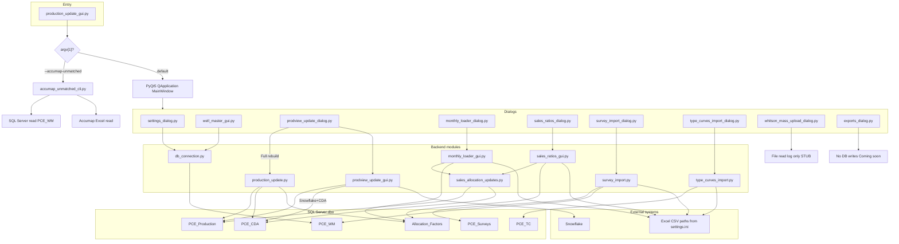
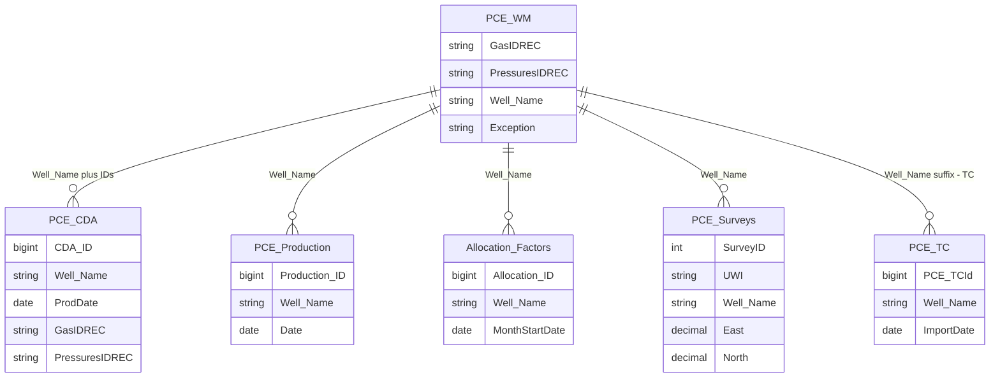

# Production Update System — User Guide

**Organization:** Pacific Canbriam Energy LTD  
**Document version:** 1.3  
**Last updated:** April 19, 2026  

## Document purpose and scope

This User Guide describes the **Production Update System** (desktop application) used within Pacific Canbriam Energy LTD. It documents prerequisites, main-window operations, module-specific procedures, the principal SQL Server tables and views, a maintenance runbook, and logical schema diagrams. The intended audience is staff authorized to run production updates, allocations, and related imports.

Documentation entry points: **[README.md](README.md)** (how to run from source), **[DEV_GUIDE.md](DEV_GUIDE.md)** (short stakeholder overview), and this guide for operational detail.

---

## Table of contents

1. [Before you start](#before-you-start) (includes [README and config templates](#readme-and-config-templates))  
2. [How the pieces fit together](#how-the-pieces-fit-together)  
3. [Application architecture and data flow](#application-architecture-and-data-flow)  
4. [Main window](#main-window)  
5. [Settings](#settings)  
6. [Well Master List](#well-master-list)  
7. [Prodview / Snowflake — Daily Production Retrieve](#prodview--snowflake--daily-production-retrieve)  
8. [Production Accounting Allocations (PA)](#production-accounting-allocations-pa)  
9. [Public Sales Data and Ratios](#public-sales-data-and-ratios)  
10. [Survey Data Import](#survey-data-import)  
11. [Type Curves Import](#type-curves-import)  
12. [Whitson+ Mass Upload](#whitson-mass-upload)  
13. [Exports / Reports](#exports--reports)  
14. [Operational considerations](#operational-considerations)  
15. [Runbook — script order and maintenance](#runbook--script-order-and-maintenance)  
16. [Troubleshooting](#troubleshooting)  
17. [Appendix A — Figures checklist](#appendix-a--figures-checklist-for-screenshots)  
18. [Appendix B — Glossary](#appendix-b--glossary)  
19. [Appendix C — Logical database schema (SQL Server)](#appendix-c--logical-database-schema-sql-server)  

---

## Before you start

### Prerequisites

- Network connectivity to the company **SQL Server** instance and, for Prodview and Snowflake well import, to **Snowflake**.  
- **Windows** host; SQL Server access uses **Windows authentication** unless otherwise configured.  
- **`.env`** in the application directory (or project root when running from source), containing Snowflake and any server/database overrides. Connection defaults may reference environment variables such as `SQL_SERVER` and `SQL_DATABASE` (confirm values with IT).  
- **`settings.ini`** adjacent to the executable or project folder. It holds **SQL display names** and **template file paths**; these are **typically the same for everyone** when files live on a **shared drive**. Values are written when **Settings** is saved.

### Execution

- **Deployed build:** Run the packaged executable (for example `ProductionUpdate.exe`) from a directory that includes `.env` and `settings.ini` where applicable.  
- **From source (project folder):** Install runtime dependencies, then start the main window:

```text
cd /d I:\ETL_Load
python -m pip install -r requirements.txt
python production_update_gui.py
```

In **PowerShell**, use `cd I:\ETL_Load` (no `/d`). Use your actual project folder in place of `I:\ETL_Load` if different.

- **Accumap UWI audit (terminal only, no GUI window):** Uses the same Accumap path rules as Public Sales (`settings.ini` **Accumap Template** unless you pass `-a`). Example:

```text
python production_update_gui.py --accumap-unmatched --month "Aug 2025"
python production_update_gui.py --accumap-unmatched -m "Aug 2025" -a "I:\path\Accumap.xlsx"
```

Optional CSV output: add `-o "I:\path\accumap_audit.csv"` (see `accumap_unmatched_cli.py`).

Credential, VPN, and ODBC driver requirements are managed by IT; obtain confirmation before production use.

### README and config templates

The project folder includes **[README.md](README.md)** (how to run from source and links to all guides), **`.env.example`** (Snowflake and optional SQL variable names — copy to `.env` and fill in), and **`settings.ini.example`** (path placeholders — copy to `settings.ini` or save once from **Settings** in the app).

### Automated tests (developers)

From the project folder, install dev dependencies and run **pytest** (no GUI; uses mocks where applicable):

```text
python -m pip install -r requirements-dev.txt
python -m pytest -q
```

---

## How the pieces fit together

### Data objects (summary)

| Object | Role |
|--------|------|
| `PCE_WM` | Well master: well list and linkage to Snowflake identifiers (**GasIDREC**, **PressuresIDREC**). Wells absent or excluded here may be omitted from daily loads. |
| `PCE_CDA` | Daily-style production rows sourced from Snowflake (and related processing). |
| `PCE_Production` | Production history for reporting; sequences, cumulatives, and averages derived from CDA and allocation passes. |
| `PCE_TC` | Type-curve metrics from the **Type Curves** Excel import (GUI) or **YE2/YE23** bulk script. WM-backed stored **`[Well Name]`** is the **longer** of cleaned Excel vs **`PCE_WM.[Well Name]`**, plus literal **` - TC`**. File-only rows that **do not** match WM use Excel text; if the name starts with **`YE2`** (including **`YE23`**), it is stored **verbatim** with **no** **` - TC`** suffix; other file-only rows get **` - TC`**. **`PCE_Production`** receives a **materialized** copy at **`ImportDate`** via **`sync_tc_to_production`**. |
| `PCE_Surveys` | Survey stations and geometry loaded from Excel or CSV; keyed by **`SurveyID`** with **`UWI`**, **`[Well Name]`**, **`East`**, **`North`**, and related survey metrics. |
| `Allocation_Factors` | Monthly allocation inputs: **ValNav**-sourced fields are written by **PA**; **Accumap**-sourced sales gas fields are written by **Public Sales Data and Ratios** (see below). |

**Optional reporting views:** Your DBA may deploy read-only views (for example joins between production and type curves). The desktop app does **not** ship view DDL in the application package; routine ETL uses **`PCE_TC`**, **`PCE_Production`**, and Python-side **`sync_tc_to_production`** instead of view-based writes.

**Production Accounting Allocations (PA)** loads **ValNav** data into **`Allocation_Factors`**, then updates **`PCE_CDA`** and **`PCE_Production`** only for **S2 gas** and **condensate sales** (the same columns that depend on ValNav-based factors), via **`monthly_loader_gui.py`** calling **`sales_allocation_updates.apply_valnav_allocation_to_cda_and_production`**.

**Public Sales Data and Ratios** loads **Accumap** (public sales gas) into **`Allocation_Factors`**, then updates **`PCE_CDA`** and **`PCE_Production`** for **gas sales production** and **sales CGR**, using **`sales_ratios_gui.py`** and **`sales_allocation_updates`**.

### Reference sequence

1. Maintain **Well Master** (including new wells from Snowflake where required).  
2. Execute **Prodview / Snowflake** per the agreed refresh schedule.  
3. Run **PA** when the monthly **ValNav** file is ready (PA applies ValNav to **`Allocation_Factors`** and refreshes **S2** and **condensate sales** on **`PCE_CDA`** / **`PCE_Production`**).  
4. Run **Public Sales Data and Ratios** when the **Accumap** file is ready and you need **gas sales** and **sales CGR** updated for a month range (it applies Accumap to **`Allocation_Factors`** and updates the remaining sales fields on **`PCE_CDA`** / **`PCE_Production`**).

**Why this order:** Daily wellhead-style rows should already exist in **`PCE_CDA`** from Prodview. **PA** does not replace **Public Sales**—each module owns a different subset of **`Allocation_Factors`** and of the calculated sales columns. The Public Sales dialog may warn you if factors or CDA rows are missing for the selected range.

**Sales Ratios cancel:** If you cancel during a run, the app stops **between months**; completed months stay committed.

---

## Application architecture and data flow

The diagram below is a **logical** map of the Python entry point, dialogs, backend modules, external systems, and SQL Server tables the application reads and writes during normal use. For **script order**, **destructive steps**, and **verification**, see [Runbook — script order and maintenance](#runbook--script-order-and-maintenance).

For a **single-image** architecture overview (one Mermaid figure plus short notes), see **[`APPLICATION_ARCHITECTURE.md`](APPLICATION_ARCHITECTURE.md)**.



**Legend (behavior the diagram summarizes):**

- **Well Master — Import New Wells** (`well_master_gui`): inserts into **`PCE_WM`** only; it does **not** update **`PCE_CDA`** or **`PCE_Production`**. Run **Prodview / Snowflake** when you need daily data for new wells.
- **Prodview — Snowflake → CDA + production rebuild** (`prodview_update_gui.run_quick_update`): uses a **fixed rolling ~18 calendar month** Snowflake window (start/end from `prodview_date_bounds.quick_update_date_range` — end date is **today minus a short lag**, typically **2** days). Pulls Snowflake for that span, replaces matching **`PCE_CDA`** rows, deletes **`PCE_Production`** rows in that date range **except** type-curve keys (`[Well Name]` ending **` - TC`**) and **YE2-family** keys (`[Well Name]` LIKE **`YE2%`**), reloads all **`PCE_CDA`** for the production pass, recomputes sequences/cumulatives/averages in Python, **deletes and re-inserts** **`PCE_Production`** for every well name in the rebuilt dataset (full history per well for those keys), then runs **`sync_tc_to_production`** so **`PCE_TC`** rows are materialized into **`PCE_Production`**. The Prodview dialog **does not** expose **From**/**To** pickers; the window is automatic. *(This is the default radio: **Snowflake → CDA + production rebuild**.)*
- **Prodview Full Rebuild** (`production_update.main`): **does not** call Snowflake. It first repaints selected sales-related columns on **`PCE_CDA`** from **`Allocation_Factors`** (when allocation rows exist), then **deletes all rows in **`PCE_Production`**** and rebuilds production from **all** of **`PCE_CDA`**, then runs **`sync_tc_to_production`** (same type-curve materialization as the Snowflake path).
- **`run_prodview_update`** in `prodview_update_gui.py` (range-based Snowflake + SQL insert path) exists in code but is **not** invoked from the current Prodview dialog; the dialog uses **Snowflake → CDA + production rebuild** and **Full rebuild** only.

---

## Main window

Application title: **Pacific Canbriam Energy - Production Update System**. Header: **Pacific Canbriam Energy LTD** / **Production Update System**. **Settings** is located in the top-right of the header.

**Operations** exposes eight modules (each opens a modal dialog):

| # | Control label |
|---|----------------|
| 1 | Well Master List |
| 2 | Prodview / Snowflake — Daily Production Retrieve |
| 3 | Production Accounting Allocations (PA) |
| 4 | Public Sales Data and Ratios |
| 5 | Survey Data Import |
| 6 | Type Curves Import |
| 7 | Whitson+ Mass Upload |
| 8 | Exports / Reports |

Operation buttons are mutually exclusive (single selection). Closing a dialog clears the selection.

The **Operation log** records timestamped lines (`[HH:MM:SS] …`). Status text (for example **Ready**) appears below the log.

`[IMAGE: Main window — header, Settings, all eight operation buttons, operation log]`

> **Figure 1 — Main window**  
> *[Insert screenshot: full main window including header, Operations list with all eight buttons, Operation log. Red arrow: Settings. Red arrow: Operations card. Red arrow: Operation log panel.]*

<!-- Image: assets/user-guide/figure-01-main-window.png -->


---

## Settings

**Settings** configures SQL Server display fields and default file paths.

- **SQL Server Connection:** Server and Database (persisted in `settings.ini`; `db_connection` may also read `SQL_SERVER` / `SQL_DATABASE` from `.env`).  
- **Paths** (each **Browse**): **ValNav Template**, **Accumap Template**, **Survey File**, **Type Curves File**, **Whitson+ File**.

**Save Settings** writes `settings.ini`. **Cancel** discards changes.

PA uses **ValNav Template**; **Public Sales Data and Ratios** uses **Accumap Template** for public sales gas. Survey, Type Curves, and Whitson read their paths as defaults; incorrect or missing paths produce file-not-found messages in the respective dialogs.

`[IMAGE: Settings dialog — SQL Server fields, path rows, Save Settings]`

> **Figure 2 — Settings**  
> *[Insert screenshot: Settings dialog showing SQL Server fields and all file path rows with Browse. Red arrow: Save Settings. Red arrow: ValNav / Accumap paths.]*

<!-- Image: assets/user-guide/figure-02-settings.png -->


---

## Well Master List

**Objective:** Maintain `PCE_WM`: view and edit permitted attributes, stage additions, Excel import/export, **Import New Wells** from Snowflake, and removal of selected wells.

**View/Edit:** Search, column edits where enabled, **Refresh**, **Save Changes**, Excel operations, **Update from Snowflake**, **Remove Selected**. Identifier fields (for example Well Name, GasIDREC, PressuresIDREC) are fixed after creation.

**Add New:** Stage rows; **Save to Database** commits staged data.

### Import New Wells (Snowflake)

**Preview New Wells** lists candidate wells. Uncheck rows to exclude them; only checked rows are inserted. Confirm selection, then **Add Wells**.

**Caution (Snowflake `*` and tester-only wells):** Leading **asterisks (`*`)** on well or unit names in the preview come from Snowflake’s naming convention; they are **not kept as part of the stored Well Name**—the application **strips leading asterisks** when you confirm **Add Wells** (including after you edit the name in the preview table). If Snowflake returns wells that exist **only as Tester records** (no Daily meter yet), the app first opens **New Wells – GasIDREC Required**: you must **enter the correct GasIDREC** from ProdView for each row you keep (**PressuresIDREC** is shown read-only from Snowflake on that screen); after you confirm or skip that step, **Preview New Wells** and **Add Wells** work as described above.

### After importing new wells

Importing wells updates **`PCE_WM` only**. The application does **not** automatically load **PCE_CDA** or **PCE_Production**. When you are ready for daily data, run **Prodview / Snowflake** (for example the default **Snowflake → CDA + production rebuild** rolling window, or a **Full rebuild** if that is what your process uses).

`[IMAGE: Well Master View/Edit tab — table, Save Changes, Import New Wells]`

> **Figure 3 — Well Master View/Edit**  
> *[Insert screenshot: Well Master dialog, View/Edit tab, search and table. Red arrow: Save Changes. Red arrow: Import New Wells (Snowflake).]*

<!-- Image: assets/user-guide/figure-03-well-master-view.png -->


`[IMAGE: Preview New Wells — checkboxes and Add Wells]`

> **Figure 4 — Preview New Wells**  
> *[Insert screenshot: Preview New Wells with checkbox column, Well Name / IDs, Add Wells. Red arrow: checkbox column. Red arrow: Add Wells.]*

<!-- Image: assets/user-guide/figure-04-preview-new-wells.png -->


---

## Prodview / Snowflake — Daily Production Retrieve

**Objective:** Keep **`PCE_CDA`** and **`PCE_Production`** aligned with Snowflake (**Snowflake → CDA + production rebuild**, default) or rebuild **`PCE_Production`** from all **`PCE_CDA`** using **`Allocation_Factors`** (**Full rebuild**). Both paths finish by materializing **`PCE_TC`** into **`PCE_Production`** via **`sync_tc_to_production`**.

### Dialog layout

- **Overview** — One-line scope for the selected mode (typical duration **~5 min** for either mode, including type-curve sync on the Quick path).  
- **Update mode** — Two radio buttons (**Snowflake → CDA + production rebuild** is selected by default):
  - **Full rebuild — PCE_Production from all PCE_CDA** — Refreshes selected **`PCE_CDA`** sales columns from **`Allocation_Factors`**, then deletes **all** rows in **`PCE_Production`** and rebuilds from **all** of **`PCE_CDA`**. **Does not** call Snowflake. Progress bar runs **indeterminate** with an **elapsed-time** status while the job runs.  
  - **Snowflake → CDA + production rebuild** — Single Snowflake pull for the **rolling ~18 calendar months** ending on the application’s **effective end date** (**about today minus 2 days** by default — see `PRODVIEW_DATA_LAG_DAYS` in `prodview_date_bounds.py`). **No From/To pickers** in the dialog; the calendar span is **computed automatically**. Replaces **`PCE_CDA`** for that window, rebuilds **`PCE_Production`** for wells in the merged dataset (see **Caution** below), then runs **`sync_tc_to_production`**.  
- **This will:** — Bullet summary that tracks the selected mode (matches the dialog’s **ℹ️ This will:** panel).

### Snowflake → CDA + production rebuild — behavior summary

1. **Trim** future-dated **`PCE_CDA`** / **`PCE_Production`** rows beyond the effective end date (and related caps).  
2. **Pull Snowflake** for every day from the rolling-window **start** through **end** (inclusive).  
3. **Replace** **`PCE_CDA`** rows whose **`ProdDate`** falls in that window; **delete** **`PCE_Production`** rows whose **`Date`** falls in the same window **except** rows whose **`[Well Name]`** ends with **` - TC`** (type-curve materialized keys) or starts with **`YE2`** (YE2/YE23-style keys).  
4. Reload all **`PCE_CDA`** for the production rebuild pass, apply well-name mapping and first-production filtering, recompute sequences, cumulatives, monthly averages, and on-production year.  
5. For each well name in the rebuilt dataset, **delete all rows** in **`PCE_Production`** for that well, then bulk **re-insert** production (so **entire per-well history** is refreshed for wells in scope—not only the 18-month window).  
6. Call **`sync_tc_to_production`** so **`PCE_TC`** rows appear on **`PCE_Production`** at their **`ImportDate`**.

**Caution:** Step 5 can change **full** production history for ordinary wells touched by the rebuild, not only the rolling window months. Avoid cancelling mid-run; the confirmation dialog warns that cancellation may be **best-effort** and that partial commits are possible.

### Full rebuild — behavior summary

1. Repaint Gas S2, gas sales, condensate sales, and Sales CGR on **`PCE_CDA`** from **`Allocation_Factors`** for every distinct allocation month (when allocation rows exist).  
2. **Delete all rows** in **`PCE_Production`** and rebuild from **all** rows currently in **`PCE_CDA`**.  
3. **Does not** query Snowflake.  
4. Call **`sync_tc_to_production`** (via **`production_update.main`**).

Typical runs are on the order of **~5 minutes**; very large databases can take longer. There are **no date-range controls** for Full rebuild.

### Procedure

1. Open **Prodview / Snowflake — Daily Production Retrieve**.  
2. Confirm **Overview** and **Update mode** (**Snowflake → CDA + production rebuild** for routine refreshes; **Full rebuild** only when **`PCE_CDA`** is already trusted and you need a full production table rebuild from CDA + allocations).  
3. Select **Run Update**, acknowledge the confirmation, monitor **Results** and the progress bar (**determinate** for **Snowflake → CDA + production rebuild**, **indeterminate** with elapsed timer for **Full rebuild**).  
4. **Close** exits the dialog; if a job is running, the app warns that cancellation may not stop SQL immediately.

`[IMAGE: Prodview dialog — Overview, Update mode, This will, Results, Run Update]`

> **Figure 5 — Prodview dialog**  
> *[Insert screenshot: Overview card; Full rebuild vs Snowflake radios; “This will:” panel; Results; Run Update. Red arrow: mode. Red arrow: Run Update.]*

<!-- Image: assets/user-guide/figure-05-prodview.png -->


---

## Production Accounting Allocations (PA)

**Objective:** For the selected month, write **ValNav**-based rows and columns into **`Allocation_Factors`**, then update **`PCE_CDA`** and **`PCE_Production`** for **S2 gas** and **condensate sales** only, via **`sales_allocation_updates.apply_valnav_allocation_to_cda_and_production`**.

**Prerequisites:** **ValNav Template** set in **Settings**; ValNav source file must exist for the target month.

**Accumap** is **not** part of this step: public **sales gas** and **sales CGR** are handled when you run **Public Sales Data and Ratios** using the **Accumap Template**.

**Month control:** Dropdown contains roughly the **last 24** calendar months, **oldest first**. Select the month that matches the files being loaded (first list item is the oldest in the window).

**Procedure**

1. Open **Production Accounting Allocations (PA)**.  
2. Select **Month**.  
3. Verify status: database and **ValNav file**.  
4. **Run Monthly Loader**; confirm the dialog.  
5. Review **Results** (counts, warnings, elapsed time).

`[IMAGE: PA dialog — month, ValNav path, status, Run Monthly Loader, Results]`

> **Figure 6 — PA allocations**  
> *[Insert screenshot: PA dialog with month, ValNav path, status lines, Results. Red arrow: Month. Red arrow: Run Monthly Loader.]*

<!-- Image: assets/user-guide/figure-06-pa-allocations.png -->


---

## Public Sales Data and Ratios

**Objective:** Apply **Accumap** (public sales gas) to **`Allocation_Factors`**, then update **`PCE_CDA`** and **`PCE_Production`** for **gas sales production** and **sales CGR** (and aligned columns computed in the same pass). **S2 gas** and **condensate sales** should already be current from **PA** for months where you ran ValNav first.

**Prerequisites:** **Accumap Template** in **Settings**; run **PA** first for months where ValNav-based allocation and S2/condensate sales fields need to be current.

**Month range:** **From** and **To** list every month from **January 2008** through the **current calendar month**, oldest first. Default **From** is **Jan 2008**; default **To** is the **current month** (full history through the current month unless changed).

**Run Update** → confirm → monitor the log.

`[IMAGE: Public Sales dialog — From, To, Run Update, log]`

> **Figure 7 — Public Sales Data and Ratios**  
> *[Insert screenshot: dialog with From/To combos, info panel, Run Update. Red arrow: From. Red arrow: To. Red arrow: Run Update.]*

<!-- Image: assets/user-guide/figure-07-public-sales.png -->


---

## Survey Data Import

**Objective:** Load survey rows from Excel or CSV into **`PCE_Surveys`** (UWI, well name, MD/TVD, inclination, azimuth, East/North, etc.). Three import sources are available: Settings bulk file, directional layout mapping, and **Accumap Survey Import** (multi-well Directional Survey export with auto-detected headers).

For each imported survey row, **`PCE_Surveys.[Well Name]`** is taken from Well Master: **`[Composite Name]`** when non-empty on the matched WM row, otherwise **`[Well Name]`**. Bulk import resolves this via **`[Value Navigator UWI]`** when possible, and otherwise via the same well-name matching keys used to find the WM row.

There are **two import paths** in the Survey dialog:

1. **Bulk (Settings path)** — Uses **Survey File** from **Settings** (read-only path in the dialog). This is the **legacy** flat-table flow: the first row is headers; columns are matched by name (matching is **case-insensitive** after normalization). The file may be **Excel** (`.xlsx` / `.xls`) or **comma-separated** `.csv` (Excel-style export). Change **Settings** to repoint the file.

2. **Directional / mapped import** — Choose this mode to **Browse** to any `.xlsx` / `.xls` / `.csv` file whose layout varies by vendor. CSV is treated as a **single sheet** (no sheet picker). Click **Configure mapping…** to open a **second dialog**: pick the sheet, set the **header row** and **first data row**, choose the **well name** cell, and map file columns to survey fields (**Measured Depth** is required). **UWI** and **Pad** are **not** taken from the Excel file; after the well name is read, the app looks up **one** row in **`PCE_WM`** by matching the cell text to **`[Well Name]`** (same field used across Well Master and production) and uses **`[Value Navigator UWI]`** and **`[Pad Name]`** for every survey row. You can **Load/Save** mapping presets (JSON) for repeat layouts.

**Import Mode (GUI):** **Append Mode** (insert rows not already present) or **Overwrite Mode** (delete existing rows for matching UWIs, then insert). Applies to both paths.

Execute **Run Import**; review the **Import Log**.

`[IMAGE: Survey dialog — path, Append/Overwrite, Run Import, log]`

> **Figure 8 — Survey Data Import**  
> *[Insert screenshot: Survey dialog with Path, Append/Overwrite radios, Import Log. Red arrow: Path. Red arrow: Run Import.]*

<!-- Image: assets/user-guide/figure-08-survey-import.png -->


---

## Type Curves Import

**Settings:** **Type Curves File** path; the dialog shows it read-only.

**Modes:** **Append from Excel** (**Load from file**, optional multi-select, **Run**) or **Delete from PCE_TC** (**Load from DB**, **Delete**). Writes **`dbo.PCE_TC`**, then refreshes matching **`PCE_Production`** rows (same **`[Well Name]`** as **`PCE_TC`**, **`[Date]`** = **`ImportDate`**) via **`sync_tc_to_production`**.

**Sheet:** First worksheet, **row 1** = headers. Ignored columns include **TC/Production**, **Date**, **Days Seq**, **Day Seq UPRT**. **`ImportDate`** is the import run date.

**Gas S1 → S2:** Vendor **Gas S1 Production (10³m³)** maps to **`[Gas S2 Production (10³m³)]`** (single gas column in the table).

**Units:** **Gas WH** mcf/d → **`[Gas WH Production (e³m³/d)]`**; **Condensate WH** bbl/d → **`[Condensate WH (m³/d)]`**; **Cum Gas** bcf → **`[Cum Gas (e³m³)]`**; **Cum Condy** Mbbl → **`[Cum Condy (m³)]`**. **Gas S2** and **condensate sales** rates and cumulatives from the workbook are converted to metric and stored only in the **`(10³m³)`**, **`(m³/d)`**, and cumulative **`(m³)`** / **`(e³m³)`** columns on **`PCE_TC`**.

**Well matching:** Normalized text (spaces, hyphens, case, slashes, digit runs). With **≥ six** hyphen parts, the last **two** are dropped **only for the WM lookup key** (for example `…-26W6M - T3 - PnP` → `…-26W6M`); shorter ids stay intact. **Meridian `M`:** an optional trailing **`M`** after **`W` + digits** at the **end** of the match key (for example Excel **`26W6M`**) is ignored so it can align with WM **`26W6`**. **Stored base id** for a WM match is the **longer** of the full cleaned Excel cell and the resolved WM **`[Well Name]`** (tie → WM), then **` - TC`**. The scan list shows **`[WM]`** vs **`[File]`**; file-only rows import without WM. **YE23 / YE2-family** file wells (name starts with **`YE2`**, e.g. **`YE23 McD …`**) keep the Excel well string **as-is** (no **` - TC`**).

**Pad names:** Values from the workbook **Pad** column are normalized to a hyphenated slug. The **`PCE-TC-`** prefix is applied to **`[Pad Name]`** only for **non–YE2-family** type curves (stored **`[Well Name]`** does **not** match the application’s YE2-style rule — i.e. does not start with **`YE2`**). **YE2** / **YE23**-style rows keep the slug **without** the **`PCE-TC-`** prefix.

**Append:** No selection = every row in the file (WM-backed and file-only). Per stored key in scope, existing TC rows for that key are replaced from the file. Unmatched (no WM) names appear in the type-curve log on scan/import.

**YE WH mirroring:** For stored **`[Well Name]`** values matching **`LIKE 'YE2%'`** (including **`YE23`**), import sets **`[Gas WH Production (e³m³/d)]`** from the Gas S2 rate and **`[Condensate WH (m³/d)]`** from the condensate sales rate so **`PCE_TC`** (and **`sync_tc_to_production`**) carry both WH and S2/sales columns.

**TC WH cumulatives on production:** **`sync_tc_to_production`** maps **`PCE_TC.[Gas WH Cumulative Production (10³m³)]`** and **`[Condensate WH Cumulative Production (m³)]`** into the same-named cumulative columns on **`PCE_Production`**; if either is null, it uses **`[Cum Gas (e³m³)]`** or **`[Cum Condy (m³)]`** respectively.

**Schema note:** **`PCE_Production`** is keyed in practice by **`([Well Name], [Date])`** uniqueness; type-curve materialized rows use the same **`[Well Name]`** as **`PCE_TC`** and **`[Date]`** = **`ImportDate`**.

**Log:** Counts, warnings, and errors appear in the dialog log.

`[IMAGE: Type Curves dialog — modes, path, Run/Delete, log]`

> **Figure 9 — Type Curves Import**  
> *[Insert screenshot: Append from Excel / Delete from PCE_TC radios, path, list, Run / Delete, Log.]*

<!-- Image: assets/user-guide/figure-09-type-curves.png -->


---

## Whitson+ Mass Upload

**Objective:** Select a sheet from the **Whitson+ File** (**Settings**) for the upload workflow.

1. Verify **Path**.  
2. **Load Sheets** — populate sheet names from the workbook.  
3. Select **Sheet**.  
4. **Post Data** — runs the worker thread.

**Note:** The current implementation performs file read and logging only; the log includes **`[STUB]`** lines and does not invoke an external API. Behavior may change in a future release; refer to internal release notes.

`[IMAGE: Whitson dialog — Path, Load Sheets, Sheet, Post Data, log]`

> **Figure 10 — Whitson+ Mass Upload**  
> *[Insert screenshot: Whitson dialog with Path, Load Sheets, Sheet combo, Upload Log, Post Data. Red arrow: Load Sheets. Red arrow: Sheet. Red arrow: Post Data.]*

<!-- Image: assets/user-guide/figure-10-whitson.png -->


---

## Exports / Reports

The dialog displays a **Coming soon** notice. No export jobs are initiated from this module in the current build.

---

## Operational considerations

- **Full Rebuild** clears and repopulates **`PCE_Production`** from all **`PCE_CDA`** rows after refreshing selected **`PCE_CDA`** sales columns from **`Allocation_Factors`**. It does **not** pull Snowflake. Reserve it for full production-table refresh scenarios, not for “fix one month in isolation” unless you understand the full recompute scope.  
- **Snowflake → CDA + production rebuild** is the usual mode for routine Snowflake refreshes (automatic rolling ~18 months); remember it recomputes **entire well histories** in **`PCE_Production`** for wells touched by the post-merge **`PCE_CDA`** dataset.  
- Avoid forced termination of the application during active jobs; use dialog **Close** and cancel paths where provided. The Prodview dialog explicitly warns that cancellation may not stop work immediately and that the Snowflake + production job can leave partial commits after a successful step.  
- Production database changes should follow company backup and change-control practices.

---

## Runbook — script order and maintenance

Use this section for **routine refreshes**, **new wells**, and **optional CLI utilities**. Commands assume a Windows Command Prompt or PowerShell session with the working directory set to your application folder (for example `I:\ETL_Load`).

### Routine GUI refresh (recommended order)

| Step | Action | Depends on | Destructive? | Verify |
|------|--------|--------------|----------------|--------|
| 1 | **Settings** — confirm SQL Server, **ValNav** and **Accumap** paths | — | No | **Save Settings**; reopen Settings to confirm persistence. |
| 2 | **Well Master** — add or fix wells, **Import New Wells** if needed | Valid **`PCE_WM`** for every well you expect in Snowflake | Removing wells deletes dependent rows (see purge note below) | Row exists in **`PCE_WM`** with **GasIDREC** populated for Snowflake pulls. |
| 3 | **Prodview** — **Snowflake → CDA + production rebuild** (default) or **Full rebuild** | Step 2 for new wells; VPN/Snowflake for Snowflake mode | **Yes** — see [Prodview / Snowflake](#prodview--snowflake--daily-production-retrieve) (CDA window replace; full per-well **`PCE_Production`** rebuild for wells in scope; **`sync_tc_to_production`**) | Dialog **Results**: row counts, `SNOWFLAKE + PRODUCTION COMPLETE` summary; spot-check dates in **`PCE_CDA`**. |
| 4 | **PA** — **Run Monthly Loader** for each ValNav month | Step 3 for current CDA; ValNav file on disk | **Yes** — writes **`Allocation_Factors`** and updates S2/condensate columns in **`PCE_CDA`** / **`PCE_Production`** for that month | Results log; allocation and production values for sample wells. |
| 5 | **Public Sales** — **Run Update** for month range | **PA** for same months when ValNav side must be current; Accumap file | **Yes** — writes Accumap side of **`Allocation_Factors`** and updates gas sales / sales CGR on **`PCE_CDA`** / **`PCE_Production`** | Results log; warnings if factors missing. |
| 6 | Optional **Survey**, **Type Curves** | Survey: **`PCE_WM`** lookup for UWI/pad; TC: WM names | Survey overwrite deletes by UWI; TC **Delete** truncates keys in **`PCE_TC`** | Import logs; row counts. |
| 7 | Optional **Full Rebuild** (Prodview) | Current **`PCE_CDA`** is trusted | **Yes** — deletes **all** **`PCE_Production`** then rebuilds | Long run; final summary from **`production_update`**; row counts. |

**After new wells only:** Background job fills **`PCE_CDA`** for the new keys; run **Step 3** (**Snowflake → CDA + production rebuild**) or **Step 7** (**Full rebuild**) when you need **`PCE_Production`** aligned.

### If something fails

- Capture the **Results** / Operation log text and the approximate step (Snowflake, SQL insert, allocation month *n*, and so on).  
- **Do not** kill the process during **Prodview / Snowflake** (**Snowflake → CDA + production rebuild** or **Full rebuild**) unless IT approves recovery; partial transactions can leave mixed state.  
- Re-run from the last **known-good** step after fixing the root cause (connectivity, missing file, bad month selection). Use database restore procedures per IT if data is inconsistent.

### CLI and utility scripts

| Command / script | Purpose | Depends on | Destructive? | Verify |
|------------------|---------|------------|--------------|--------|
| `python production_update_gui.py` | Opens main GUI | `.env`, `settings.ini`, ODBC | No | Window opens; Settings saves. |
| `python production_update_gui.py --accumap-unmatched -m "Aug 2025"` | Prints matched/unmatched Accumap UWIs; optional `-o` CSV | **`PCE_WM`**, Accumap path | No (read-only) | Terminal output or CSV. |
| `python production_update.py` | Same pipeline as **Prodview Full Rebuild**: refresh CDA sales from **`Allocation_Factors`**, delete all **`PCE_Production`**, rebuild from **`PCE_CDA`** | Populated **`PCE_CDA`** | **Yes** — full **`PCE_Production`** delete | Console summary; row counts. |
| `python survey_import.py "<path>"` then `append` or `overwrite` | Survey import without GUI | File on disk, **`PCE_WM`** for mapping | **Overwrite** deletes existing rows for matching UWIs, then inserts; **append** skips (UWI, depth) pairs already in **`PCE_Surveys`** before insert | Console / exit code. |
| `python purge_exception_wells.py` | Deletes **`PCE_CDA`**, **`PCE_Production`**, **`Allocation_Factors`**, **`PCE_Surveys`** rows for wells with **`PCE_WM.Exception = 'Y'`** | Exception flags set deliberately | **Yes** | Printed delete counts. |

`[IMAGE: Runbook reference — example SSMS row-count query results after a refresh]`

---

## Troubleshooting

| Symptom | Checks |
|---------|--------|
| SQL Server connection failure | VPN, server name, Windows authentication, ODBC drivers; `.env` / environment variables versus actual deployment. |
| Snowflake errors | `SNOWFLAKE_*` variables in `.env`; network path to Snowflake. |
| Well absent from CDA | Well present in **`PCE_WM`** with **GasIDREC** populated; **Exception** flags; CDA load executed (**Prodview / Snowflake** in **Snowflake → CDA + production rebuild** mode, or post–new-well background job) for dates covering Snowflake data. |
| Production looks wrong after Prodview / Snowflake | Remember **full-well** **`PCE_Production`** rebuild for wells in the merged CDA set; re-run **PA** / **Public Sales** for months that must be reapplied after CDA changed underneath. |

Escalate with **Results** / log excerpts to database or application support per internal procedures.

---

## Appendix A — Figures checklist (for screenshots)

| Figure # | Suggested filename | What to capture | Red arrow notes |
|----------|-------------------|-----------------|-----------------|
| 1 | `figure-01-main-window.png` | Full main window | Settings; Operations list; Operation log |
| 2 | `figure-02-settings.png` | Settings dialog | Save Settings; ValNav + Accumap paths |
| 3 | `figure-03-well-master-view.png` | Well Master View/Edit | Save Changes; Import New Wells |
| 4 | `figure-04-preview-new-wells.png` | Preview New Wells | Checkbox column; Add Wells |
| 5 | `figure-05-prodview.png` | Prodview dialog | Overview; Update mode radios; This will; Run Update |
| 6 | `figure-06-pa-allocations.png` | PA dialog | Month; Run Monthly Loader |
| 7 | `figure-07-public-sales.png` | Public Sales dialog | From; To; Run Update |
| 8 | `figure-08-survey-import.png` | Survey import | Path; Run Import |
| 9 | `figure-09-type-curves.png` | Type Curves import | Mode radios; Run / Delete |
| 10 | `figure-10-whitson.png` | Whitson+ dialog | Load Sheets; Sheet; Post Data |

---

## Appendix B — Glossary

| Term | Definition |
|------|------------|
| `PCE_WM` | Well master table: identifiers and attributes per well. |
| `PCE_CDA` | Daily-style production data from Snowflake for wells in the well master (plus allocation-driven sales columns). |
| `PCE_Production` | Production history with sequences, cumulatives, and averages for downstream use. |
| `PCE_TC` | Type-curve metrics from the **Type Curves** GUI import and/or **YE2/YE23** bulk script; stored **`[Well Name]`** rules and **pad** rules are as in [Type Curves Import](#type-curves-import). |
| `Allocation_Factors` | Monthly allocation data: ValNav side from **PA**; Accumap (sales gas) from **Public Sales Data and Ratios**. |
| GasIDREC / PressuresIDREC | Snowflake keys linking a well to meter/completion data. |
| Composite Name | Production row naming derived from well master mapping where applicable. |
| Snowflake → CDA + production rebuild | **Prodview** default mode: automatic **rolling ~18 calendar months** of Snowflake → **`PCE_CDA`** (end ≈ **today minus 2 days** by default), then **`PCE_Production`** rebuild for wells in the merged dataset and **`sync_tc_to_production`**. **No** **From**/**To** pickers in the dialog. |
| Full Rebuild | Repaint selected **`PCE_CDA`** sales columns from **`Allocation_Factors`**, then delete all rows in **`PCE_Production`** and rebuild from **all** **`PCE_CDA`**; **no** Snowflake call. |

---

## Appendix C — Logical database schema (SQL Server)

The following **entity-relationship diagram is logical**: the application and well keys imply the relationships below. SQL Server might not declare every relationship as a foreign key. Column inventory is maintained from **`INFORMATION_SCHEMA.COLUMNS`** exports (see `output.txt` in the project folder for a recent tab-separated example).

**Tables included:** `PCE_WM`, `PCE_CDA`, `PCE_Production`, `Allocation_Factors`, `PCE_Surveys`, `PCE_TC`. Optional database views (if any) are DBA-maintained; the application does not ship view DDL. Type-curve data is joined in reporting via **`PCE_TC`** and materialized **`PCE_Production`** rows, not via application-bundled SQL view scripts.



`[IMAGE: Rendered ER diagram — logical PCE tables from Appendix C for Word]`

---

*End of User Guide.*
